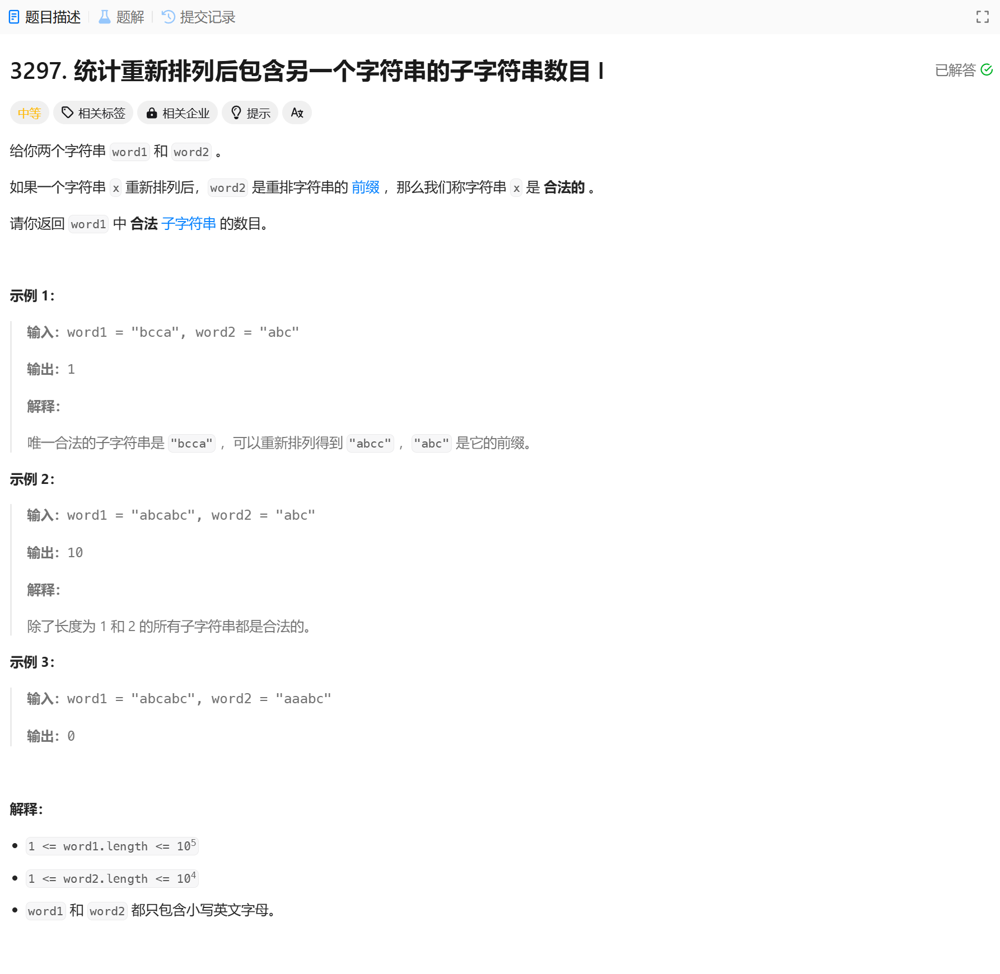

# 3297. 统计重新排列后包含另一个字符串的子字符串数目 I
## 题目链接  
[3297. 统计重新排列后包含另一个字符串的子字符串数目 I](https://leetcode.cn/problems/count-substrings-that-can-be-rearranged-to-contain-a-string-i/description/?envType=daily-question&envId=2025-01-09)
## 题目详情


***
## 解答一
答题者：EchoBai

### 题解
滑动窗口。基本思想是先统计word2字符出现的频率和有效字符的种类less，然后遍历word1，维护一个大小为less的窗口。依次检查是对应位置是否相同，相同则word1对应种类n++，如此当n大于less的时候，这个时候可能我们以及往word1走了一段距离，此时处于right端点处，因此我们需要统计出包含有效字符的区间长度也就是找到left位置，这样的话从0,1...,left-1的位置一共left个字串都是有效的。然后移动窗口继续即可。

### 代码
``` cpp
class Solution {
public:
    long long validSubstringCount(string word1, string word2) {
        int len1 = word1.length(), len2 = word2.length();
        if(len1 < len2) return 0;
        long long res = 0;
        int w1map[26]{};
        int w2map[26]{};
        int less = 0;
        for(const auto& w : word2){
            if(++w2map[w - 'a'] == 1){
                ++less;
            }
        }

        int n = 0;
        int left = 0;
        for(int i = 0; i < len1; ++i){
            int idx = word1[i] - 'a';
            if(++w1map[idx] == w2map[idx]){
                ++n;
            }

            while(n >= less){
                idx = word1[left] - 'a';
                if(w1map[idx] == w2map[idx]){
                    --n;
                }
                --w1map[idx];
                ++left;
            }
            res += left;
        }
        return res;
    }

};
```
