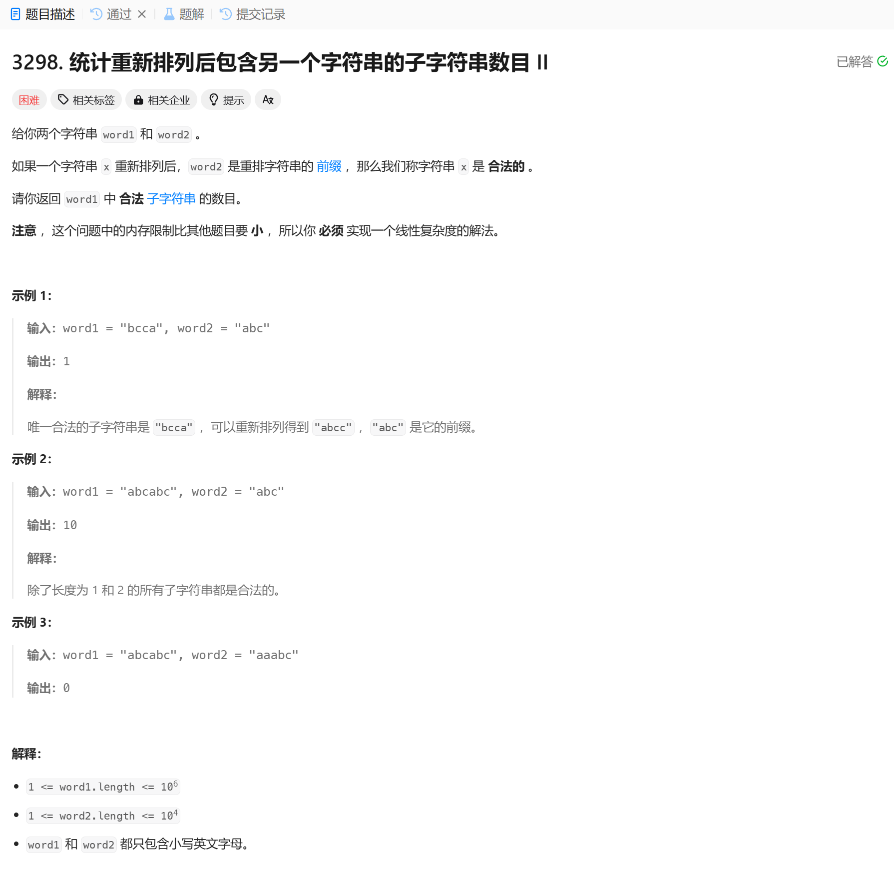

# 3298. 统计重新排列后包含另一个字符串的子字符串数目 II
## 题目链接  
[3298. 统计重新排列后包含另一个字符串的子字符串数目 II](https://leetcode.cn/problems/count-substrings-that-can-be-rearranged-to-contain-a-string-ii/description/?envType=daily-question&envId=2025-01-10)
## 题目详情


***
## 解答一
答题者：EchoBai

### 题解
滑动窗口。同3297

### 代码
``` cpp
class Solution {
public:
    long long validSubstringCount(string word1, string word2) {
        int len1 = word1.length();
        int len2 = word2.length();
        if(len1 < len2) return 0;
        long long ans = 0;
        int left = 0;
        int w1cnt[26]{};
        int w2cnt[26]{};
        int cnt = 0;
        for(const char& c : word2){
            if(++w2cnt[c - 'a'] == 1){
                ++cnt;
            }
        }
        int n = 0;
        for(int i = 0; i < len1; ++i){
            int idx = word1[i] - 'a';
            if(++w1cnt[idx] == w2cnt[idx])++n;
            while(n >= cnt){
                idx = word1[left] - 'a';
                if(w1cnt[idx] == w2cnt[idx]){
                    --n;
                }
                --w1cnt[idx];
                ++left;
            }
            ans += left;
        }
        return ans;
    }
};
```
