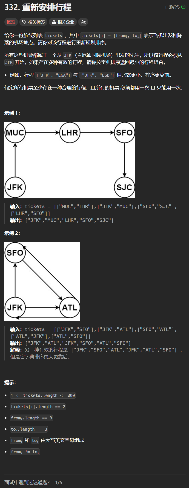

# 332. 重新安排行程
## 题目链接  
[332. 重新安排行程](https://leetcode.cn/problems/reconstruct-itinerary/description/)
## 题目详情


***
## 解答一
答题者：**Yuiko630**

### 题解
>回溯，用Map<String, Map<String, Integer>>存放起始地->目的地，航班次数，当路径大小=票的大小+1时终止，循环条件航班次数>0且票的起始地是路径中最后一个的目的地。注意将ticket转换成map时需要保证起始地相同时，按照目的地的升序排列。

### 代码
``` Java
class Solution {
    private Deque<String> res;
    private Map<String, Map<String, Integer>> map;

    private boolean backTracking(int ticketNum){
        if(res.size() == ticketNum + 1){
            return true;
        }
        String last = res.getLast();
        if(map.containsKey(last)){//防止出现null
            for(Map.Entry<String, Integer> target : map.get(last).entrySet()){
                int count = target.getValue();
                if(count > 0){
                    res.add(target.getKey());
                    target.setValue(count - 1);
                    if(backTracking(ticketNum)) return true;
                    res.removeLast();
                    target.setValue(count);
                }
            }
        }
        return false;
    }

    public List<String> findItinerary(List<List<String>> tickets) {
        map = new HashMap<String, Map<String, Integer>>();
        res = new LinkedList<>();
        for(List<String> t : tickets){
            Map<String, Integer> temp;
            if(map.containsKey(t.get(0))){
                temp = map.get(t.get(0));
                temp.put(t.get(1), temp.getOrDefault(t.get(1), 0) + 1);
            }else{
                temp = new TreeMap<>();//升序Map
                temp.put(t.get(1), 1);
            }
            map.put(t.get(0), temp);

        }
        res.add("JFK");
        backTracking(tickets.size());
        return new ArrayList<>(res);
    }
}
```

***
## 解答二
答题者：**EchoBai**

### 题解
>用unordered_map<string, priority_queue<string,vector<string>,greater<string>>> 建立图，类似邻接表结构，并且使用优先队列（小顶堆）这样每次取堆顶元素都是最小的，且取走之后内部会自行重新调整堆结构保证堆顶永远是最小的。然后使用dfs遍历即可。

### 代码
```c++
class Solution {
    unordered_map<string, priority_queue<string,vector<string>,greater<string>>> graph;
    vector<string> res;
public:
    vector<string> findItinerary(vector<vector<string>>& tickets) {
        for(const auto& ticket : tickets){
            graph[ticket[0]].emplace(ticket[1]);
        }
        dfs("JFK");
        reverse(res.begin(),res.end());
        return res;
    }

    void dfs(const string& node){
        auto& cur = graph[node];
        while(!cur.empty()){
            string next = cur.top();
            cur.pop();
            dfs(next);
        }
        res.push_back(node);
    }
};
```