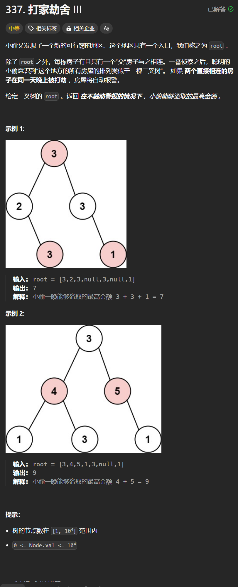

# 337. 打家劫舍III
## 题目链接  
[337. 打家劫舍III](https://leetcode.cn/problems/house-robber-iii/description/)
## 题目详情


***
## 解答一
答题者：**Yuiko630**

### 题解
>当前状态是由前面的状态决定的，dp，五部曲
>1. 定义:dp[2]，长度为2的数组，记录不偷该节点得到最大和偷该节点得到最大
>2. 转移方程:如果为空节点返回{0,0}，否则返回{max(left[0], left[1]) + max(right[0], right[1]), cur.val + left[0] + right[0]}
>3. 初始化:默认为0即可
>4. 遍历:递归后序遍历
>5. 推导

### 代码
``` Java
/**
 * Definition for a binary tree node.
 * public class TreeNode {
 *     int val;
 *     TreeNode left;
 *     TreeNode right;
 *     TreeNode() {}
 *     TreeNode(int val) { this.val = val; }
 *     TreeNode(int val, TreeNode left, TreeNode right) {
 *         this.val = val;
 *         this.left = left;
 *         this.right = right;
 *     }
 * }
 */
class Solution {
    public int rob(TreeNode root) {
        int[] result = robNode(root);
        return Math.max(result[0], result[1]);
    }
    public int[] robNode(TreeNode node) {
        int[] dp = new int[2];
        if(node == null) {
            return dp;
        }
        int[] left = robNode(node.left);
        int[] right = robNode(node.right);
        dp[0] = Math.max(left[0], left[1]) + Math.max(right[0], right[1]);
        dp[1] = node.val + left[0] + right[0];
        return dp;
    }
}
```