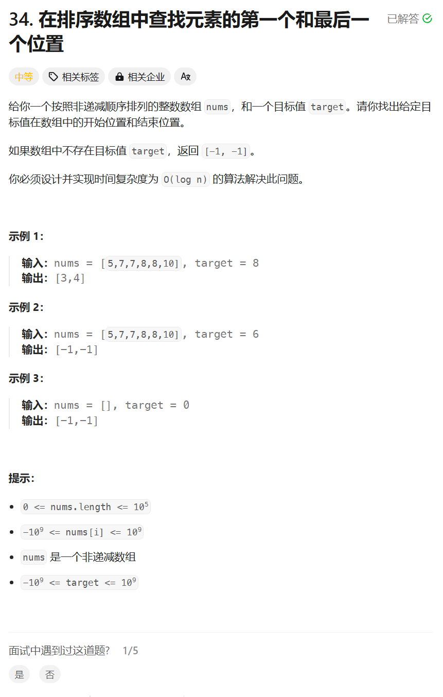

# 34. 在排序数组中查找元素的第一个和最后一个位置
## 题目链接  
[34. 在排序数组中查找元素的第一个和最后一个位置](https://leetcode.cn/problems/find-first-and-last-position-of-element-in-sorted-array/description/)
## 题目详情


***
## 解答一
答题者：**Yuiko630**

### 题解
>两遍二分查找，先找第一个位置，再找最后一个位置。

### 代码
``` Java
class Solution {
    public int[] searchRange(int[] nums, int target) {
        int left = 0;
        int right = nums.length - 1;
        int mid = (left + right) / 2;
        int first = -1;
        int last = -1;
        while(left <= right) {
            if(nums[mid] == target){
                first = mid;
                right = mid - 1;
            }
            else if(nums[mid] > target){
                right = mid - 1;
            }
            else left = mid + 1;
            mid = (left + right) / 2;
        }
        left = 0;
        right = nums.length - 1;
        mid = (left + right) / 2;
        while(left <= right) {
            if(nums[mid] == target){
                last = mid;
                left = mid + 1;
            }
            else if(nums[mid] > target){
                right = mid - 1;
            }
            else left = mid + 1;
            mid = (left + right) / 2;
        }
        return new int[]{first, last};
    }
}
```


