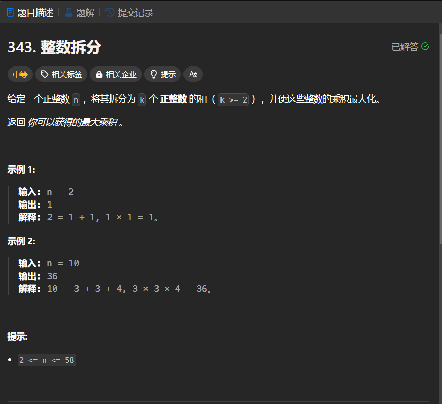

# 343. 整数拆分
## 题目链接  
[343. 整数拆分](https://leetcode.cn/problems/integer-break/description/)
## 题目详情


***
## 解答一
答题者：EchoBai

### 题解
数学推导，当拆分的数为`3`的时候乘积最为重要。因此我们需要尽可能的把数拆分为更多的3，此时会出现三种余数，为`0,1,2`，为`0`返回$3^a$，为 `1`则需要从拆出一个3，组成`2+2`的形式，为 `2`的话不用在继续拆分。

### 代码
``` cpp
class Solution {
public:
    int integerBreak(int n) {
        if(n <= 3)
            return n-1;
        int a = n / 3;
        int b = n % 3;
        if( b == 0) return pow(3,a);
        else if(b == 1) return pow(3,(a - 1)) * 4;
        else return pow(3,a) * 2;
    }
};
```


