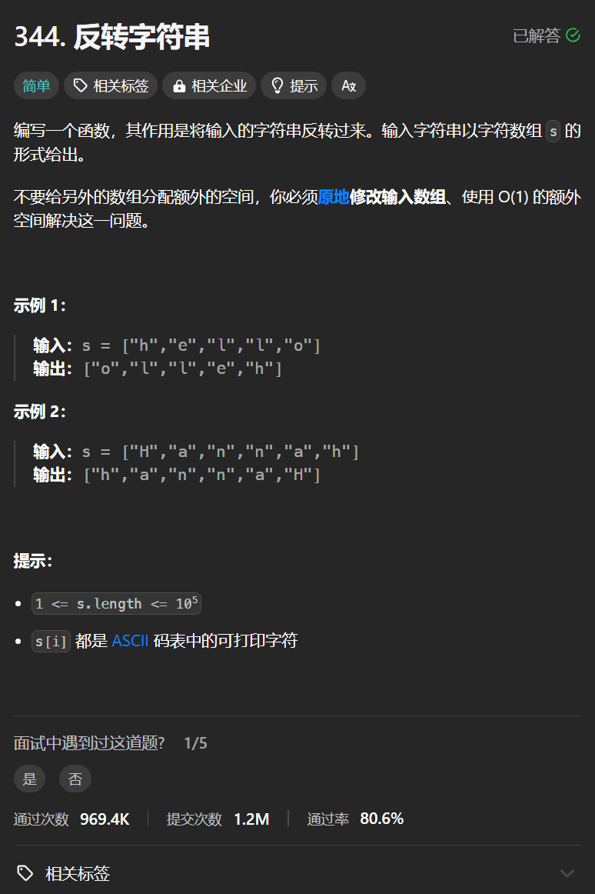

# 344. 反转字符串
## 题目链接  
[344. 反转字符串](https://leetcode.cn/problems/reverse-string/description/)
## 题目详情


***
## 解答一
答题者：**Yuiko630**

### 题解
>双指针，头尾交换，相遇结束。

### 代码
``` Java
class Solution {
    public void reverseString(char[] s) {
        int start = 0;
        int end = s.length-1;
        while(start < end){
            char tmp = s[start];
            s[start] = s[end];
            s[end] = tmp;
            start++;
            end--;
        }
    }
}
```


