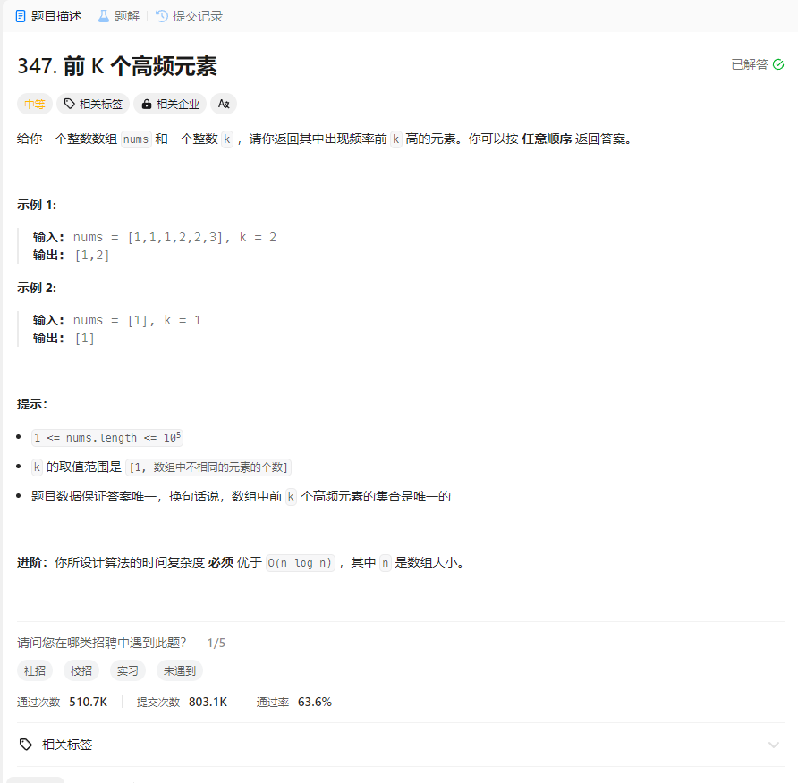

# 347. 前 K 个高频元素
## 题目链接  
[347. 前 K 个高频元素](https://leetcode.cn/problems/top-k-frequent-elements/description/)
## 题目详情


***
## 解答一
答题者：EchoBai

### 题解
`map`统计次数，然后转为`vector`排序，最后输出即可。

### 代码
``` cpp
class Solution {
public:
    vector<int> topKFrequent(vector<int>& nums, int k) {
        map<int,int> mp;
        vector<pair<int,int>> vt;
        vector<int> res;
        for(auto e : nums){
            ++mp[e];
        }
        for(auto m : mp){
            vt.push_back(make_pair(m.first,m.second));
        }
        sort(vt.begin(),vt.end(),cmp);
        int i = 0;
        while(i < k){
            res.push_back(vt[i].first);
            ++i;
        }
        return res;
    }
    static bool cmp(const pair<int,int> &p1, const pair<int,int> &p2){
        return p1.second > p2.second;
    }
};
```

## 解答二
答题者：**Yuiko630**

### 题解
>map统计频率，PriorityQueue以出现频率从大到小排序，输出前k个。

### 代码
``` Java
class Solution {
    public int[] topKFrequent(int[] nums, int k) {
        Map<Integer, Integer> map = new HashMap<>();
        for(int num:nums){
            map.put(num, map.getOrDefault(num, 0)+1);
        }
        PriorityQueue<int[]> pq = new PriorityQueue<>((pair1, pair2) -> pair2[1] - pair1[1]);
        for (Map.Entry<Integer, Integer> entry : map.entrySet()) {
            pq.add(new int[]{entry.getKey(), entry.getValue()});
        }
        int[] result = new int[k];
        for(int i = 0; i < k; i++){
            result[i] = pq.poll()[0];
        }
        return result;
    }
}
```
