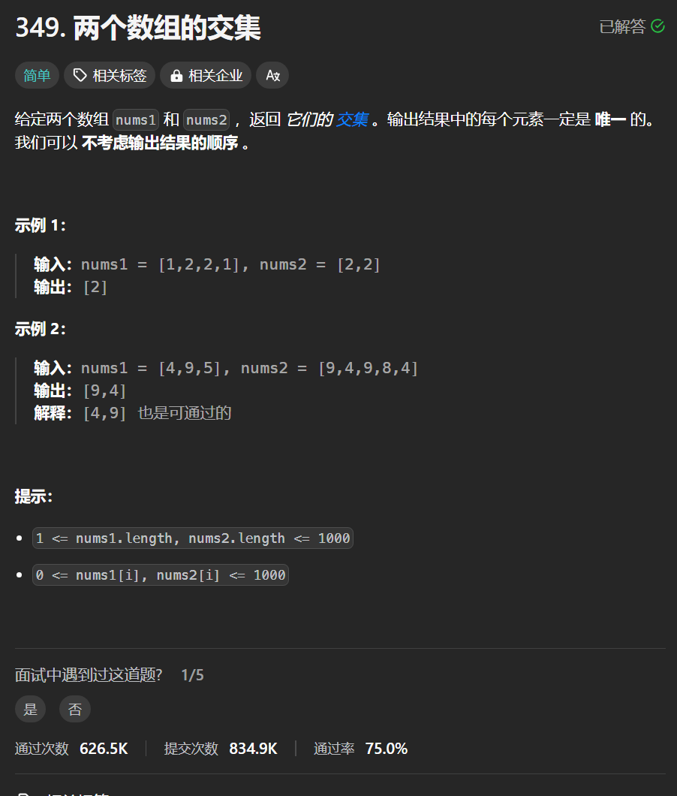

# 349. 两个数组的交集
## 题目链接  
[349. 两个数组的交集](https://leetcode.cn/problems/intersection-of-two-arrays/description/)
## 题目详情


***
## 解答一
答题者：**Yuiko630**

### 题解
>用set存放出现过的值，自动去重。

### 代码
``` Java
class Solution {
    public int[] intersection(int[] nums1, int[] nums2) {
        Set<Integer> set1 = new HashSet<>();
        for(int i:nums1){
            set1.add(i);
        }
        Set<Integer> result = new HashSet<>();
        for(int i:nums2){
            if(set1.contains(i)){
                result.add(i);
            }
        }
        return result.stream().mapToInt(x -> x).toArray();
    }
}
```


