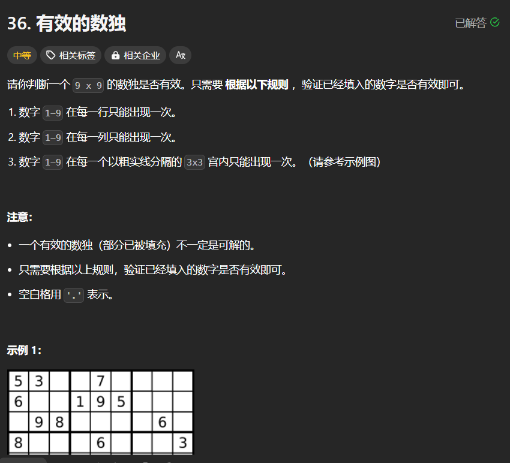

# 36. 有效的数独
## 题目链接  
[36. 有效的数独](https://leetcode.cn/problems/valid-sudoku/description/)
## 题目详情


***
## 解答一
答题者：EchoBai

### 题解
用一个`map`来统计当次的`vector`中各字符出现的次数，如果不是`.`并且出现次数大于`2`，那么即不满足数独定义，反之满足。

### 代码
``` cpp
class Solution {
public:
    bool isValidSudoku(vector<vector<char>>& board) {
        for(auto b: board){
            if(!checkSomeRange(b))
                return false;
        }
        for(int i = 0; i < 9; ++i){
            vector<char> ve;
            for(int j = 0; j < 9; ++j){
                ve.push_back(board[j][i]);
            }
            if(!checkSomeRange(ve))
                return false;
        }

        for(int i = 0; i < 9; i+=3){
            for(int j = 0; j < 9; j+=3){
                vector<char> ve;
                for(int row = 0; row < 3; ++row){
                    for(int cel = 0; cel < 3; ++cel){
                        ve.push_back(board[row+ j][cel + i]);
                    }
                }
                if(!checkSomeRange(ve))
                    return false;
            }
        }
        return true;
    }
    bool checkSomeRange(vector<char> &rc){
        map<char, int> m;
        for(auto c : rc){
            ++m[c];
            if(m[c] > 1 && c != '.')
                return false;
        }
        return true;
    }
};
```


