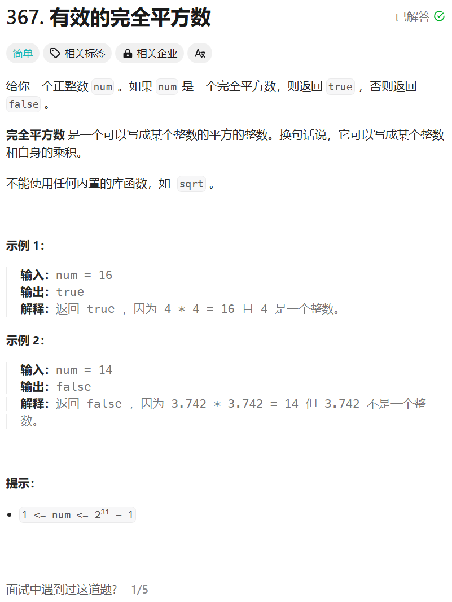

# 367. 有效的完全平方数
## 题目链接  
[367. 有效的完全平方数](https://leetcode.cn/problems/valid-perfect-square/description/)
## 题目详情


***
## 解答一
答题者：**Yuiko630**

### 题解
>二分查找，注意right边界应为**x / 2 + 1**，且mid相乘可能超出int范围。

### 代码
``` Java
class Solution {
    public boolean isPerfectSquare(int num) {
        int left = 0;
        int right = num/2+1;
        int mid = (left + right)/2;
        while(left <= right){
            if((long) mid*mid == num) return true;
            else if((long) mid*mid > num) right = mid - 1;
            else left = mid+ 1;
            mid = (left + right) / 2;
        }
        return false;
    }
}
```


