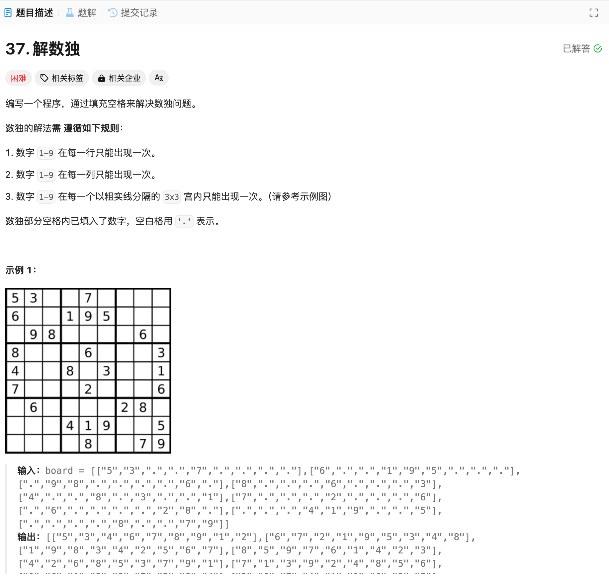

# 37. 解数独
## 题目链接  
[37. 解数独](https://leetcode.cn/problems/sudoku-solver/)
## 题目详情


***
## 解答一
答题者：EchoBai

### 题解
回溯，遍历整个数组，找到空的地方，逐个尝试1-9，如果满足数独条件则填入，继续下一个空白，否则回溯到上一个位置。

### 代码
``` cpp
class Solution {
public:
    void solveSudoku(vector<vector<char>>& board) {
        backtraceing(board);
    }

    bool backtraceing(vector<vector<char>>& board){
        for(int row = 0; row < 9; ++row){
            for(int col = 0; col < 9; ++col){
                if(board[row][col] != '.') continue;
                for(char c = '1'; c <= '9'; ++c){
                    if(isValid(row, col, board, c)){
                        board[row][col] = c;
                        if(backtraceing(board)) return true;
                        board[row][col] = '.';
                    }
                }
                return false;
            }
        }
        return true;
    }

    bool isValid(int row, int col, vector<vector<char>>& board, char choose){
        //check row
        for(int col = 0; col < 9; ++col){
            if(board[row][col] == choose){
                return false;
            }
        }

        //check col
        for(int row = 0; row < 9; ++row){
            if(board[row][col] == choose){
                return false;
            }
        }

        // check grid
        int startRow = row - row % 3;
        int startCol = col - col % 3;
        for (int i = 0; i < 3; i++) {
            for (int j = 0; j < 3; j++) {
                if (board[startRow + i][startCol + j] == choose) {
                    return false;
                }
            }
        }

        return true;
    }
};
```
