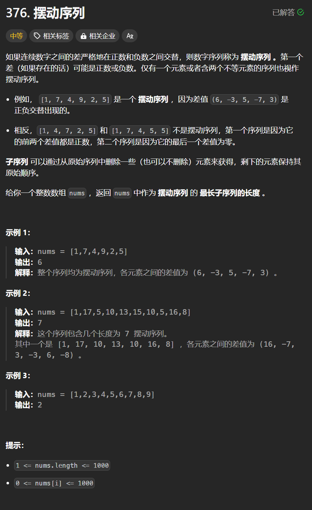

# 376. 摆动序列
## 题目链接  
[376. 摆动序列](https://leetcode.cn/problems/wiggle-subsequence/description/)
## 题目详情


***
## 解答一
答题者：**Yuiko630**

### 题解
>贪心算法，记录局部峰值即可，考虑三种特殊情况，①上下坡中有平坡，则左边差值可=0，右边不行；②数组首尾两端，考虑只有2个元素时也是摆动序列，所以初始化result为1；③单调坡中有平坡，只在坡度摆动变化时更新preDiff【其实就是记录摆动序列的差值】

### 代码
``` Java
class Solution {
    public int wiggleMaxLength(int[] nums) {
        int count = 1; 
        int preDiff = 0;
        int curDiff = 0;
        for(int i = 0; i < nums.length - 1; i++){
            curDiff = nums[i+1] - nums[i];
            if((preDiff <= 0 && curDiff > 0) || (preDiff >= 0 && curDiff < 0)){
                count ++;
                preDiff = curDiff;
            }
        }
        return count;
    }
}
```