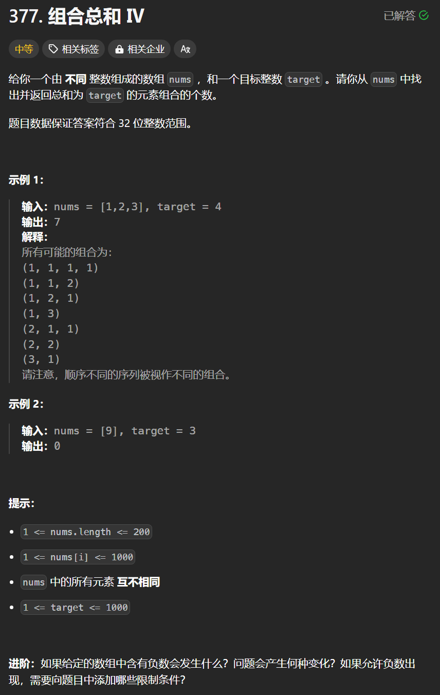

# 377. 组合总和IV
## 题目链接  
[377. 组合总和IV](https://leetcode.cn/problems/combination-sum-iv/description/)
## 题目详情


***
## 解答一
答题者：**Yuiko630**

### 题解
>dp，五部曲
>1. 定义:dp[j]表示凑成j有dp[j]种方法
>2. 转移方程:dp[j] += dp[j-nums[i]]
>3. 初始化:dp[0]=1，凑成0只有一种方法就是什么也不凑，无意义
>4. 遍历:排列问题外层遍历0-target，内层正序遍历nums
>5. 推导

### 代码
``` Java
class Solution {
    public int combinationSum4(int[] nums, int target) {
        int[] dp = new int[target + 1];
        dp[0] = 1;
        for(int j = 0; j <= target; j++){
            for(int i = 0; i < nums.length; i++){
                if(j - nums[i] >= 0){
                    dp[j] += dp[j - nums[i]];
                }
            }
        }
        return dp[target];
    }
}
```