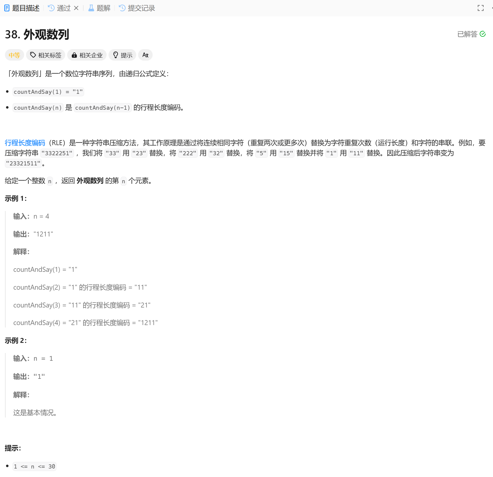

# 38. 外观数列
## 题目链接  
[38. 外观数列](https://leetcode.cn/problems/count-and-say/description/)
## 题目详情


***
## 解答一
答题者：EchoBai

### 题解
两个函数，一个从字符串开始统计连续字符出现的次数，一个从次数重组出新的字符串，如此循环n-1次即可。

### 代码
``` cpp
class Solution {
public:
    string countAndSay(int n) {
        string str = "1";
        vector<std::pair<int,int>> ct;
        for(int i = 1; i < n; ++i){
            computeTimesFromString(str, ct);
            fromTimesGetString(ct, str);
        }
        return str;
    }

    void computeTimesFromString(string str, vector<std::pair<int,int>>&ct){
        int size = str.size();
        ct.clear();
        if(size < 2){
            ct.emplace_back(str[0] - '0', 1);
            return;
        }
        int i = 0;
        while(i < size){
            int num = str[i] - '0';
            int cnt = 1;
            while((i + 1) < size && str[i + 1] == str[i]){
                ++cnt;
                ++i;
            }
            //std::cout << "(num,cnt): " << "(" << num << "," << cnt << ")" << std::endl;
            ct.emplace_back(num,cnt);
            ++i;
        }
    }

    void fromTimesGetString(vector<std::pair<int,int>>&ct, string& str){
        str.clear();
        for(auto& [num, cnt] : ct){
            str += std::to_string(cnt);
            str += std::to_string(num);
        }
    }
};
```
