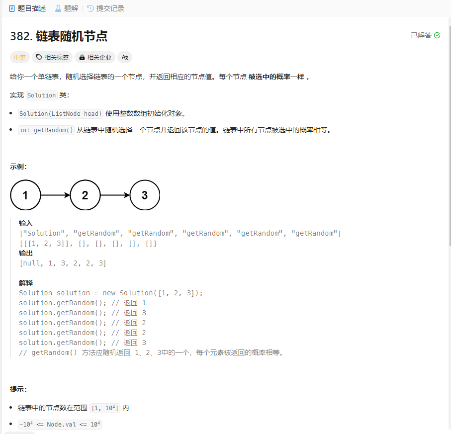

# 382. 链表随机节点
## 题目链接  
[382. 链表随机节点](https://leetcode.cn/problems/linked-list-random-node/description/)
## 题目详情


***
## 解答一
答题者：EchoBai

### 题解
`vector`将链表值压入，然后随机生成`idx`，最后输出即可。

### 代码
``` cpp
/**
 * Definition for singly-linked list.
 * struct ListNode {
 *     int val;
 *     ListNode *next;
 *     ListNode() : val(0), next(nullptr) {}
 *     ListNode(int x) : val(x), next(nullptr) {}
 *     ListNode(int x, ListNode *next) : val(x), next(next) {}
 * };
 */
class Solution {
private:
    vector<int> vt;
public:
    Solution(ListNode* head) {
        srand((unsigned)time(NULL)); 
        ListNode* p = head;
        while(p){
            vt.push_back(p->val);
            p = p->next;
        }
    }
    
    int getRandom() {
        int idx = rand() % vt.size();
        return vt[idx];
    }
};

/**
 * Your Solution object will be instantiated and called as such:
 * Solution* obj = new Solution(head);
 * int param_1 = obj->getRandom();
 */
```


