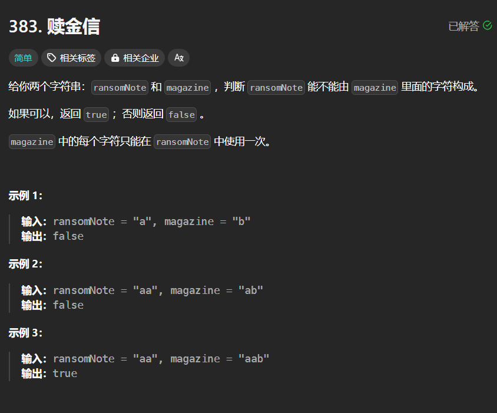

# 383. 赎金信
## 题目链接  
[383. 赎金信](https://leetcode.cn/problems/ransom-note/description/?envType=study-plan-v2&envId=top-interview-150)
## 题目详情


***
## 解答一
答题者：EchoBai

### 题解
根据题意，我们可以建议一个`mapArray`数组用来记录`magazine`字符串中每个字符出现的次数，然后遍历`ransomNote`字符串，因为`magazine`字符串需要确保每个字符使用次数，因此我们遍历的时候将`mapArray`次数减去，这样如果能表示，则不会出现小于0的情况，出现了则说明不能表示。

### 代码
``` cpp
class Solution {
public:
    bool canConstruct(string ransomNote, string magazine) {
        int mapArray[26] = {0};
        for(int i = 0; i < magazine.size(); ++i){
            ++ mapArray[magazine[i] - 'a'];
        }
        for(int i = 0; i < ransomNote.size(); ++i){
            --mapArray[ransomNote[i]- 'a'];
            if(mapArray[ransomNote[i] - 'a'] < 0)
                return false;
        }
        return true;
    }
};
```