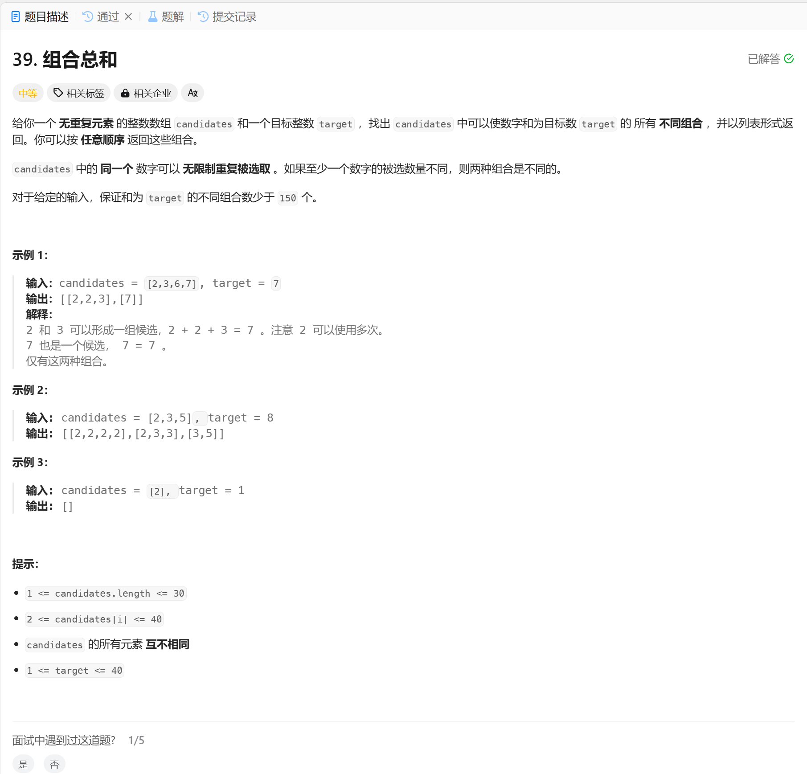

# 39. 组合总和
## 题目链接  
[39. 组合总和](https://leetcode.cn/problems/combination-sum/description/)
## 题目详情


***
## 解答一
答题者：EchoBai

### 题解
递归 + 回溯， 终止条件有2个，一是满足条件的情况，需要保存结果，然后返回，二是由于可以无限次重复选取，因此如果当前选取元素总和已经超过target了，那么也要直接返回，不然就一直选取，直到超时。

### 代码
``` cpp
class Solution {
    public:
    vector<vector<int>> res;
    vector<int> comb;
    vector<vector<int>> combinationSum(vector<int>& candidates, int target) {
        backtracking(candidates, target, 0);
        return res;
    }

    void backtracking(vector<int>& candidates, int target, int startIdx){ 
        if(accumulate(comb.begin(), comb.end(), 0) == target){
            res.push_back(comb);
            return;
        }
        if(accumulate(comb.begin(), comb.end(), 0) > target){
            return;
        }

        for(int i = startIdx; i < candidates.size(); ++i){
            comb.push_back(candidates[i]);
            backtracking(candidates, target, i);
            comb.pop_back();
        }
    }
};
```
