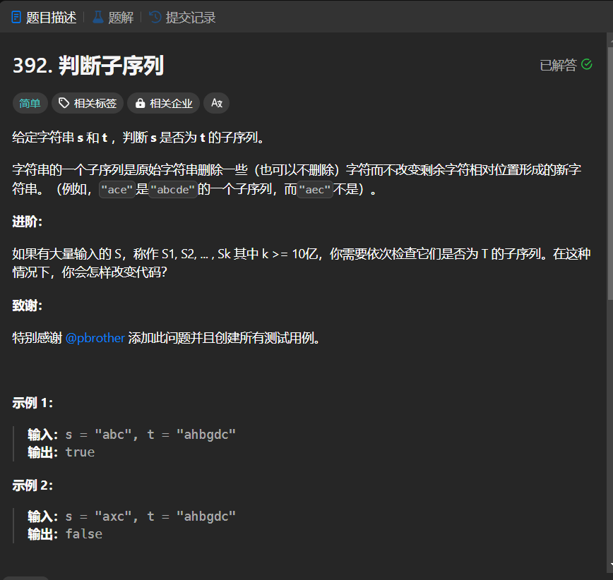

# 392. 判断子序列
## 题目链接  
[392. 判断子序列](https://leetcode.cn/problems/is-subsequence/description/?envType=study-plan-v2&envId=top-interview-150)
## 题目详情


***
## 解答一
答题者：EchoBai

### 题解
扫描`t`，当两子串有相同字符时，均往前移动一位。最后判断`s`移动的位数是否和其长度相等。

### 代码
``` cpp
class Solution {
public:
    bool isSubsequence(string s, string t) {
        int s_len = s.size();
        int t_len = t.size();
        int i = 0, j = 0;
        while(i < t_len){
            if(s[j] == t[i]){
                i++;
                j++;
            }else{
                i++;
            }
        }
        if(j == s_len)
            return true;
        return false;

    }
};
```

## 解答二
答题者：**Yuiko630**

### 题解
>定义:dp[i][j]表示包括i-1的s和包括j-1的t的相同子序列长度
>2. 转移方程:if(s[i] == t[j]) dp[i][j] = dp[i-1][j-1]+1; 匹配上前面长度+1
else dp[i][j] = dp[i][j-1]，匹配不上回退t一个字符
>3. 初始化:全为0即可
>4. 遍历:外层循环i从1-s.length，内层循环j从1-t.length
>5. 推导

### 代码
``` Java
class Solution {
    public boolean isSubsequence(String s, String t) {
        int[][] dp = new int[s.length() + 1][t.length() + 1];
        for(int i = 1; i <= s.length(); i++) {
            for(int j = 1; j <= t.length(); j++) {
                if(s.charAt(i-1) == t.charAt(j-1)) dp[i][j] = dp[i-1][j-1] + 1;
                else dp[i][j] = dp[i][j-1];
            }
        }
        return dp[s.length()][t.length()] == s.length();
    }
}
```