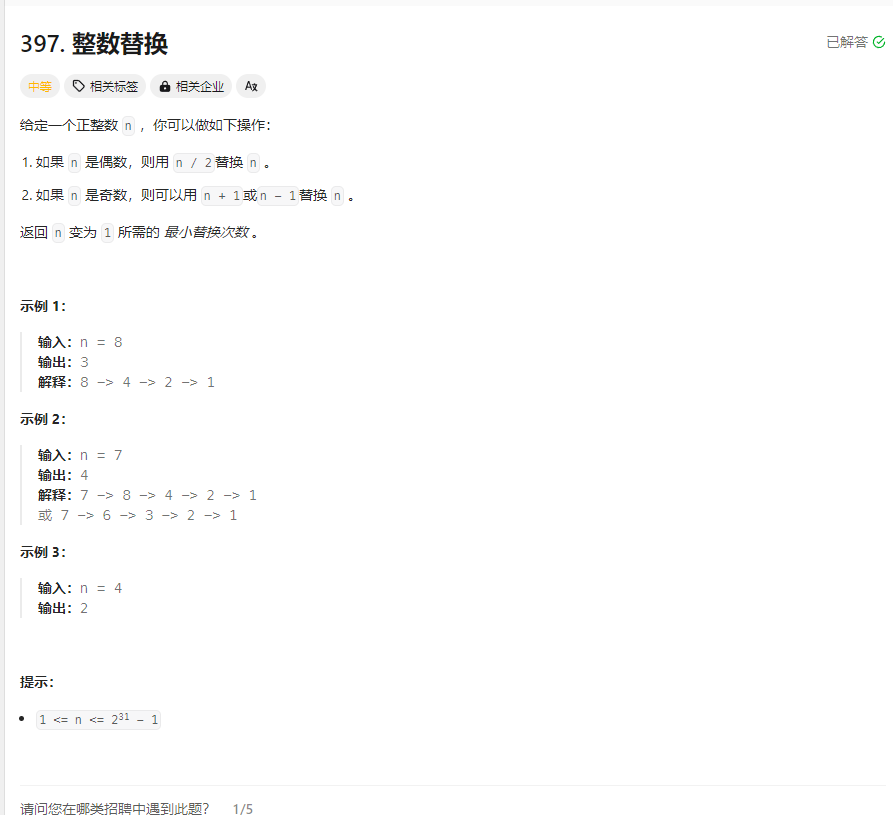

# 397. 整数替换
## 题目链接  
[397. 整数替换](https://leetcode.cn/problems/integer-replacement/description/)
## 题目详情


***
## 解答一
答题者：EchoBai

### 题解
递归即可。

### 代码
``` cpp
class Solution {
public:
    int integerReplacement(int n) {
        int res = countTimes(n);
        return res;
    }
    int countTimes(long long int n){
        int res = 0;
        if(n == 1) return 0;
        if(n % 2 == 0) {
            ++res;
            res += countTimes(n/2);
        }
        if(n % 2 == 1){
            ++res;
            int l = countTimes(n - 1);
            int r = countTimes(n + 1);
            res += min(l,r);
        }
        return res;
    }
};
```


