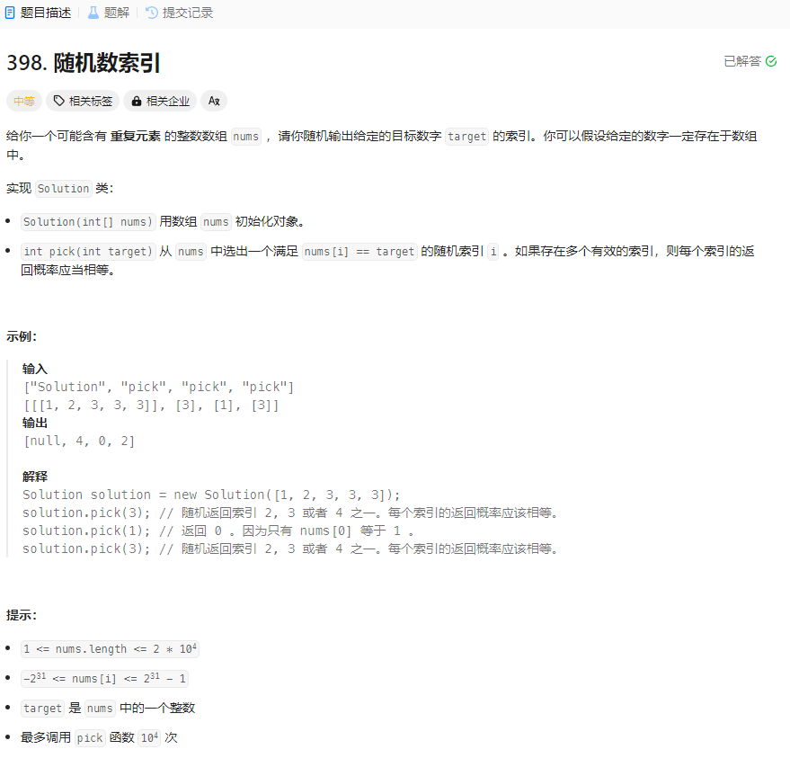

# 398. 随机数索引
## 题目链接  
[398. 随机数索引](https://leetcode.cn/problems/random-pick-index/description/)
## 题目详情


***
## 解答一
答题者：EchoBai

### 题解
建立两个`vector`整体思路还是很简单的。

### 代码
``` cpp
class Solution {
private:
    vector<int> vt;
    vector<int> idx;
public:
    Solution(vector<int>& nums) {
        vt = nums;
        srand((unsigned)time(NULL)); 
    }
    
    int pick(int target) {
        idx.clear();
        for(int i = 0; i < vt.size(); ++i){
            if(vt[i] == target)
                idx.push_back(i);
        }
        int pt = rand() % idx.size();
        return idx[pt];
    }
};

/**
 * Your Solution object will be instantiated and called as such:
 * Solution* obj = new Solution(nums);
 * int param_1 = obj->pick(target);
 */
```


