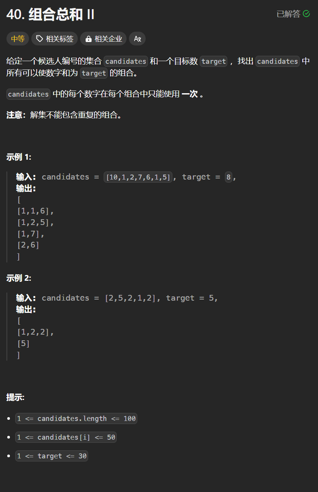

# 40. 组合总和II
## 题目链接  
[40. 组合总和II](https://leetcode.cn/problems/combination-sum-ii/description/)
## 题目详情


***
## 解答一
答题者：**Yuiko630**

### 题解
>递归+回溯，注意去掉重复的组合，可以将集合排序后在for循环中去掉同一树层上使用过的元素，递归中同一树枝上可以重复。

### 代码
``` Java
class Solution {
    List<List<Integer>> result = new ArrayList<>();
    List<Integer> res = new ArrayList<>();
    public List<List<Integer>> combinationSum2(int[] candidates, int target) {
        Arrays.sort(candidates);
        backtracking(candidates, target, 0);
        return result;
    }
    public void backtracking(int[] candidates, int targetSum, int start){
        if(targetSum == 0){
            result.add(new ArrayList(res));
            return;
        }
        if(targetSum <= 0) return;
        for(int i = start; i < candidates.length; i++){
            if ( i > start && candidates[i] == candidates[i - 1] ) {
                continue;
            }
            res.add(candidates[i]);
            backtracking(candidates, targetSum - candidates[i], i+1);
            res.removeLast();
        }
    }
}
```
