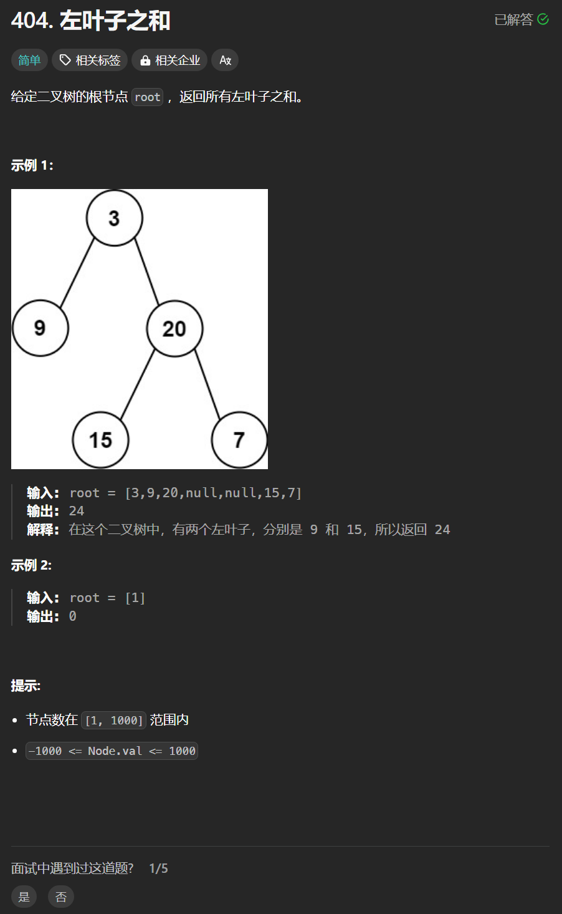

# 404. 左叶子之和
## 题目链接  
[404. 左叶子之和](https://leetcode.cn/problems/sum-of-left-leaves/description/)
## 题目详情


***
## 解答一
答题者：**Yuiko630**

### 题解
>递归，先求左子树的和，判断左子树是否为左叶子，再求右子树的和，返回中和。

### 代码
``` Java
/**
 * Definition for a binary tree node.
 * public class TreeNode {
 *     int val;
 *     TreeNode left;
 *     TreeNode right;
 *     TreeNode() {}
 *     TreeNode(int val) { this.val = val; }
 *     TreeNode(int val, TreeNode left, TreeNode right) {
 *         this.val = val;
 *         this.left = left;
 *         this.right = right;
 *     }
 * }
 */
class Solution {
    public int sumOfLeftLeaves(TreeNode root) {
        if(root == null) return 0;
        int leftValue = 0;
        leftValue = sumOfLeftLeaves(root.left);
        if(root.left != null && root.left.left == null && root.left.right == null) leftValue = root.left.val;
        int rightValue = sumOfLeftLeaves(root.right);
        return leftValue+rightValue;
    }
}
```

## 解答二
答题者：**Yuiko630**

### 题解
>迭代遍历，遍历到左叶子时，累加到result。

### 代码
``` Java
/**
 * Definition for a binary tree node.
 * public class TreeNode {
 *     int val;
 *     TreeNode left;
 *     TreeNode right;
 *     TreeNode() {}
 *     TreeNode(int val) { this.val = val; }
 *     TreeNode(int val, TreeNode left, TreeNode right) {
 *         this.val = val;
 *         this.left = left;
 *         this.right = right;
 *     }
 * }
 */
class Solution {
    public int sumOfLeftLeaves(TreeNode root) {
        Queue<TreeNode> queue = new LinkedList<TreeNode>();
        int result = 0;
        queue.offer(root);
        while(!queue.isEmpty()){
            TreeNode cur = queue.poll();
            if(cur.left!=null && cur.left.left == null && cur.left.right == null){
                result += cur.left.val;
            }
            if(cur.left != null) queue.offer(cur.left);
            if(cur.right != null) queue.offer(cur.right);
        }
        return result;
    }
}
```
