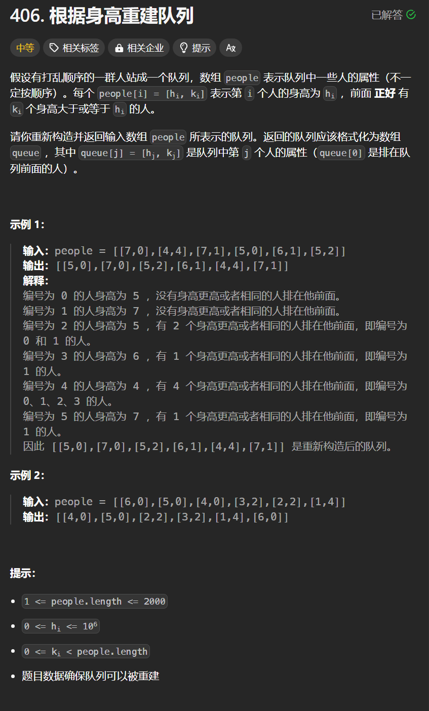

# 406. 根据身高重建队列
## 题目链接  
[406. 根据身高重建队列](https://leetcode.cn/problems/queue-reconstruction-by-height/description/)
## 题目详情


***
## 解答一
答题者：**Yuiko630**

### 题解
>先根据身高从大到小排，身高相同时k小的在前，再按身高顺序依据k插入队列位置即可。

### 代码
``` Java
class Solution {
    public int[][] reconstructQueue(int[][] people) {
        Arrays.sort(people, (a,b) -> {
            if(a[0] == b[0]) return a[1]-b[1]; // 身高相同时k升序
            return b[0]-a[0]; // 身高降序
        });
        LinkedList<int[]> que = new LinkedList<>();
        for(int[] p : people){
            que.add(p[1], p);
        }
        return que.toArray(new int[people.length][]);
    }
}
```