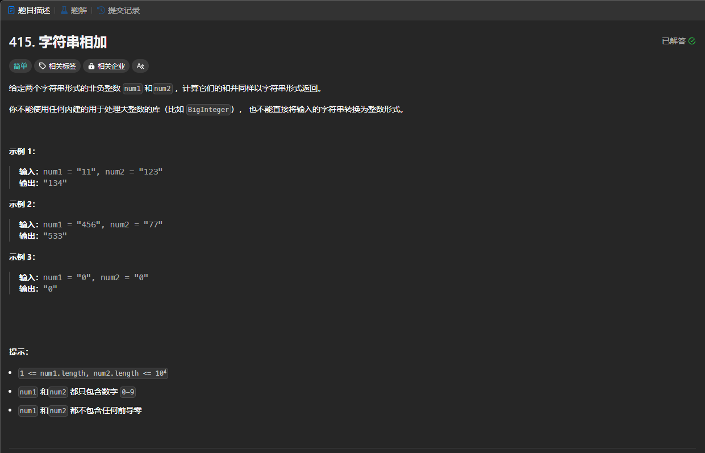

# 415. 字符串相加
## 题目链接  
[415. 字符串相加](https://leetcode.cn/problems/add-strings/description/)
## 题目详情


***
## 解答一
答题者：EchoBai

### 题解
从尾部开始依次相加，将其结果从高到低依次进行存储，记得保留好进位，最后去掉结果数组中的前导`0`，输出即可。需要注意的是，如果只是个位数相加，那么需要检查进位的情况，并更新结果数组。

### 代码
``` cpp
class Solution {
public:
    string addStrings(string num1, string num2) {
        int len1 = num1.size();
        int len2 = num2.size();
        vector<char> res(max(len1,len2) + 1 , '0');
        int len = max(len1,len2) + 1;
        int i = len1 - 1;
        int j = len2 - 1;
        int of = 0;
        while(i >= 0 && j >= 0){
            int num = (num1[i] - '0') + (num2[j] - '0') + of;
            res[len-1] = num % 10 + '0'; 
            of = num / 10;
            --i;
            --j;
            --len;
        }
        while(i >= 0){
            int num = (num1[i] - '0') + of;
            res[len-1] = num % 10 + '0'; 
            of = num / 10;
            --i;
            --len;
        }
        while(j >= 0){
            int num = (num2[j] - '0') + of;
            res[len-1] = num % 10 + '0'; 
            of = num / 10;
            --j;
            --len;
        }
        if(of > 0)
            res[--len] = of + '0';
        while(res.size() > 1 && res[0] == '0'){
            res.erase(res.begin());
        }
        string ans;
        for(auto e : res)
            ans += e;
        return ans;
    }
};
```


