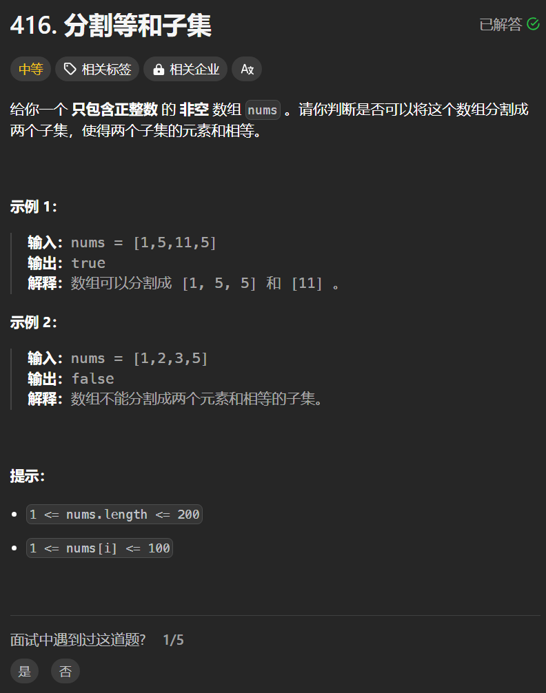

# 416. 分割等和子集
## 题目链接  
[416. 分割等和子集](https://leetcode.cn/problems/partition-equal-subset-sum/description/)
## 题目详情


***
## 解答一
答题者：**Yuiko630**

### 题解
>01背包问题，将分割的集合看作是容量为sum/2的背包，dp[j]表示容量为j的背包所背最大和，遍历每一个数组元素，嵌套从大到小遍历背包容量，最后判断背包正好装满时总和是否刚好为sum/2。

### 代码
``` Java
class Solution {
    public boolean canPartition(int[] nums) {
        int sum = 0;
        for(int i = 0; i < nums.length; i++){
            sum += nums[i];
        }
        if(sum % 2 == 1) return false;
        int[] dp = new int[sum/2+1];
        for(int i = 0; i < nums.length; i++){
            for(int j = sum/2; j >= nums[i]; j--){
                dp[j] = Math.max(dp[j], dp[j-nums[i]]+nums[i]);
            }
        }
        return dp[sum/2] == sum/2;
    }
}
```