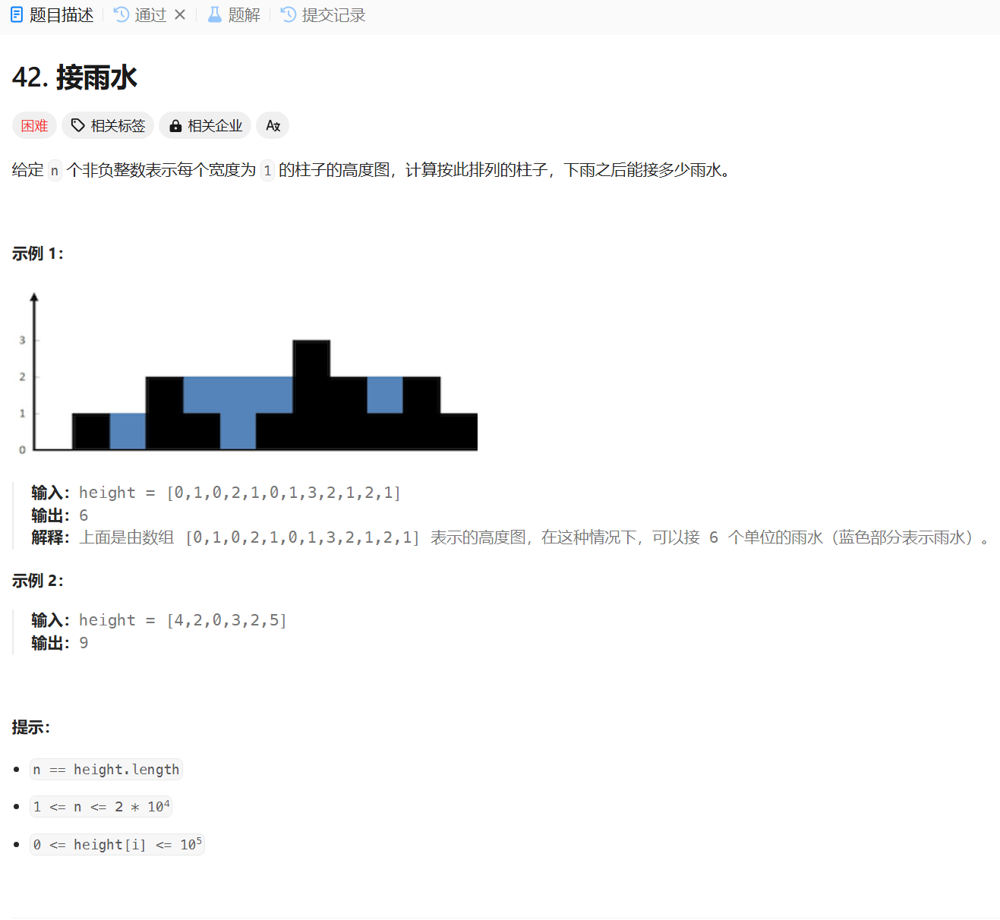

# 42. 接雨水
## 题目链接  
[42. 接雨水](https://leetcode.cn/problems/trapping-rain-water/description/)
## 题目详情


***
## 解答一
答题者：**Yuiko630**

### 题解
>双指针，left从左起，right从右起，接的雨水相当于当前两位置较高点和其半边最高点的差值。故还需要leftMax和rightMax存其半边最高点，每次比较height[left]和height[right]哪个位置较高，water+=半边最高-较高。

### 代码
``` Java
class Solution {
    public int trap(int[] height) {
        int left = 0;
        int right = height.length - 1;
        int leftMax = 0;
        int rightMax = 0;
        int water = 0;
        while(left < right){
            if(height[left] > leftMax){
                leftMax = height[left];
            }
            if(height[right] > rightMax){
                rightMax = height[right];
            }
            if(height[left] < height[right]){
                water += leftMax - height[left];
                left++;
            }
            else{
                water += rightMax - height[right];
                right--;
            }
        }
        return water;
    }
}
```


