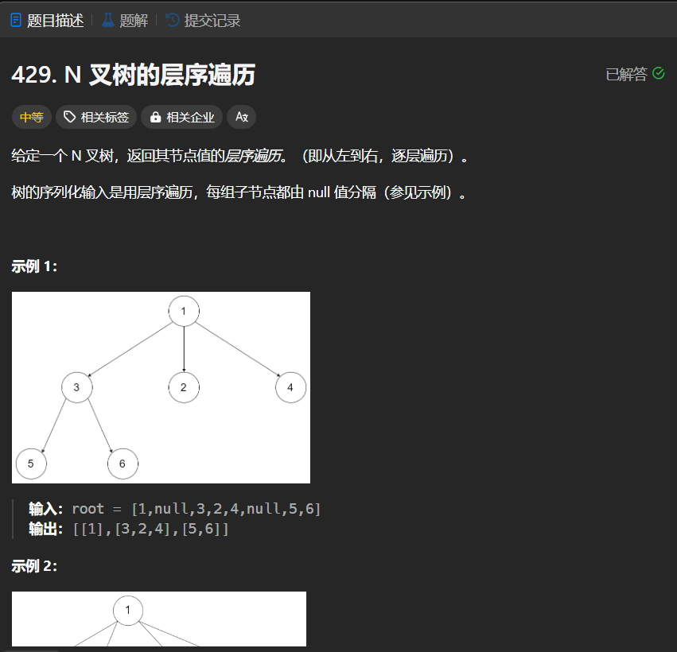

# 429. N 叉树的层序遍历
## 题目链接  
[429. N 叉树的层序遍历](https://leetcode.cn/problems/n-ary-tree-level-order-traversal/description/)
## 题目详情


***
## 解答一
答题者：EchoBai

### 题解
使用队列，首先将根入队，然后做访问操作，出队，判断根是否有孩子节点，有就依次入队。重复该操作，直到队列为空。
### 代码
``` cpp
/*
// Definition for a Node.
class Node {
public:
    int val;
    vector<Node*> children;

    Node() {}

    Node(int _val) {
        val = _val;
    }

    Node(int _val, vector<Node*> _children) {
        val = _val;
        children = _children;
    }
};
*/

class Solution {
public:
    vector<vector<int>> levelOrder(Node* root) {
        vector<vector<int>> res;
        if(!root) return res;
        queue<Node*> q;
        q.push(root);
        while(!q.empty()){
            vector<int> v;
            for(int i = q.size(); i > 0; --i){
                Node* e = q.front();
                q.pop();
                v.push_back(e->val);
                vector<Node*> ve = e->children;
                if(ve.size() > 0){
                    for(auto n : ve){
                        q.push(n);
                    }
                }
            }
            res.push_back(v);
        }
        return res;
    }
};
```


