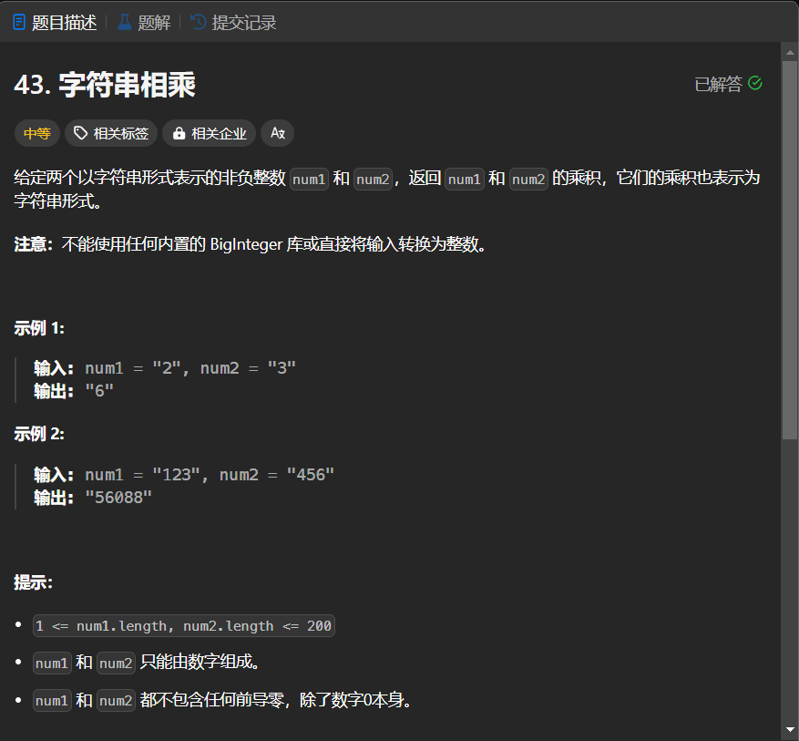

# 43. 字符串相乘
## 题目链接  
[43. 字符串相乘](https://leetcode.cn/problems/multiply-strings/description/)
## 题目详情


***
## 解答一
答题者：EchoBai

### 题解
大数相乘思想，按位相乘在相加，记得进位即可。

### 代码
``` cpp
class Solution {
public:
    string multiply(string num1, string num2) {
        int len1 = num1.size();
        int len2 = num2.size();
        vector<int> res(len1 + len2, 0);
        for(int i = len1 - 1; i >= 0; --i){
            for(int j = len2 -1; j >= 0; --j){
                int sum = (num1[i] - '0') * (num2[j] - '0') + res[i+j+1];
                res[i+j+1] = sum % 10;
                res[i+j] += sum / 10;
            }
        }
        while(res.size() > 1 && res[0] == 0)
            res.erase(res.begin());
        string ans;
        for(auto r: res)
            ans.push_back(r + '0');
        return ans;
    }
};
```


