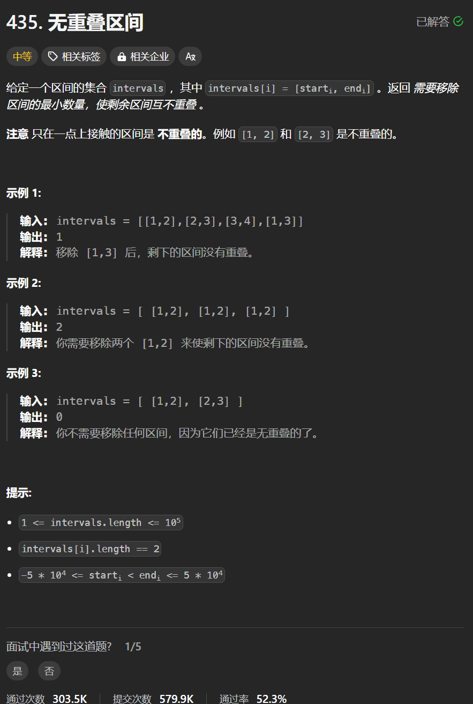

# 435. 无重叠区间
## 题目链接  
[435. 无重叠区间](https://leetcode.cn/problems/non-overlapping-intervals/description/)
## 题目详情


***
## 解答一
答题者：**Yuiko630**

### 题解
>最小移除区间的数量=总区间数量-非交叉区间数量，先根据左边界排序，再判断相邻两个区间的起始和终止。
### 代码
``` Java
class Solution {
    public int eraseOverlapIntervals(int[][] intervals) {
        int result = 1;
        // 使用Integer内置比较方法，不会溢出
        Arrays.sort(intervals, (a,b) -> Integer.compare(a[0], b[0]));
        
        for(int i = 1; i < intervals.length; i++){
            if(intervals[i][0] >= intervals[i-1][1]){
                result++;
            }
            else{
                intervals[i][1] = Math.min(intervals[i][1], intervals[i-1][1]);
            }
        }

        return intervals.length - result;
    }
}
```