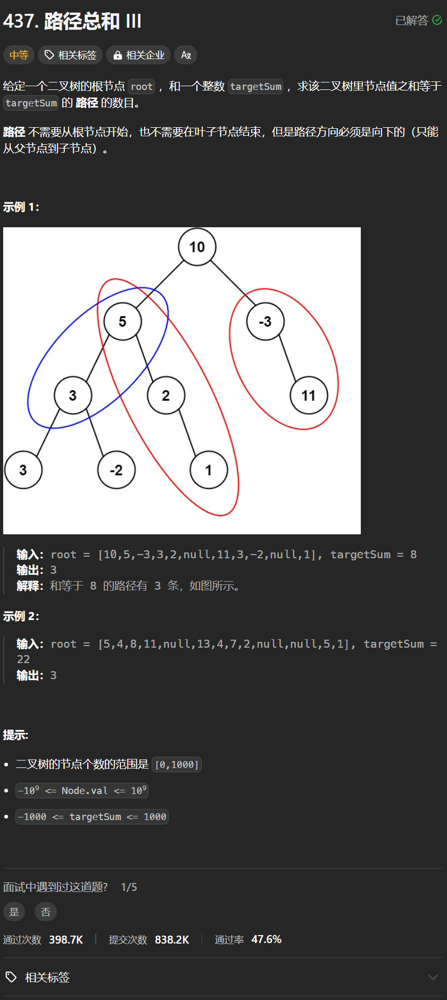

# 437. 路径总和III
## 题目链接  
[437. 路径总和III](https://leetcode.cn/problems/path-sum-iii/description/?envType=study-plan-v2&envId=top-100-liked)
## 题目详情


***
## 解答一
答题者：**Yuiko630**

### 题解
>递归前序遍历，用map记录前缀和及其出现次数，将前缀和和目标和作为参数一起传递，回溯后将map频率-1。

### 代码
``` Java
/**
 * Definition for a binary tree node.
 * public class TreeNode {
 *     int val;
 *     TreeNode left;
 *     TreeNode right;
 *     TreeNode() {}
 *     TreeNode(int val) { this.val = val; }
 *     TreeNode(int val, TreeNode left, TreeNode right) {
 *         this.val = val;
 *         this.left = left;
 *         this.right = right;
 *     }
 * }
 */
class Solution {
    int res = 0;
    Map<Long, Integer> map = new HashMap<>();
    public int pathSum(TreeNode root, int targetSum) {
        map.put(0L,1);
        return dfs(root, targetSum, 0L);
    }
    public int dfs(TreeNode root, int targetSum, Long currentSum){
        if(root == null) return 0;
        currentSum += root.val;
        int res = map.getOrDefault(currentSum - targetSum, 0);
        map.put(currentSum, map.getOrDefault(currentSum, 0) + 1);
        res += dfs(root.left, targetSum, currentSum);
        res += dfs(root.right, targetSum, currentSum);
        map.put(currentSum, map.getOrDefault(currentSum, 0) - 1);
        return res;
    }
}
```