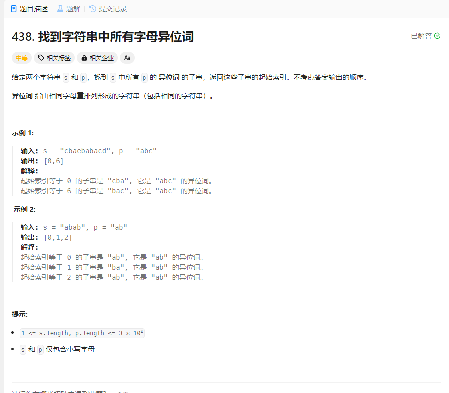

# 438. 找到字符串中所有字母异位词
## 题目链接  
[438. 找到字符串中所有字母异位词](https://leetcode.cn/problems/find-all-anagrams-in-a-string/description/?envType=study-plan-v2&envId=top-100-liked)
## 题目详情


***
## 解答一
答题者：EchoBai

### 题解
统计和`p`字符串一样长的`s`中字串的字符数量，如果相同就加入结果中。使用固定长度的滑动窗口进行遍历，将最左移出，将右边下一个移入。

### 代码
``` cpp
class Solution {
public:
    vector<int> findAnagrams(string s, string p) {
        int slen = s.size();
        int plen = p.size();
        vector<int> res;
        if(slen < plen ) return res;
        vector<int> scount(26);
        vector<int> pcount(26);
        for(int i = 0; i < plen; ++i){
            ++scount[s[i] - 'a'];
            ++pcount[p[i] - 'a'];
        }
        if(scount == pcount){
            res.push_back(0);
        }
        for(int i = 0; i < slen - plen; ++i){
            --scount[s[i]- 'a'];
            ++scount[s[i + plen] - 'a'];
            if(scount == pcount){
                res.push_back(i + 1);
            }
        }
        return res;
    }
    
};
```


