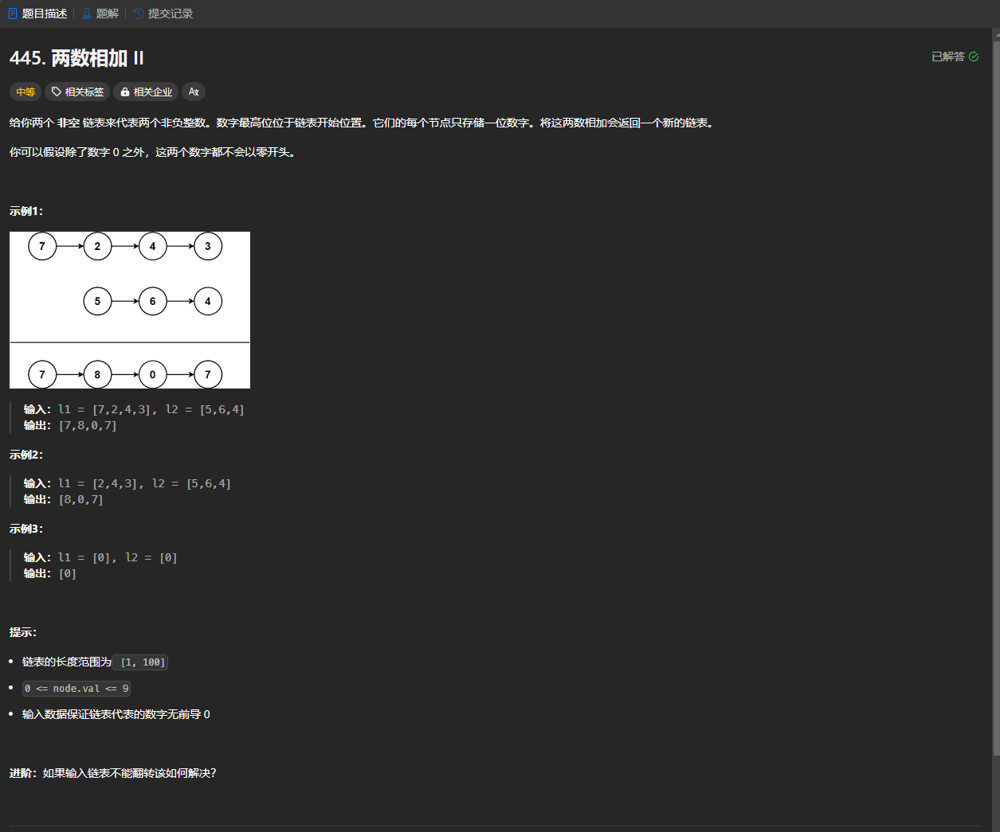

# 445. 两数相加 II
## 题目链接  
[445. 两数相加 II](https://leetcode.cn/problems/add-two-numbers-ii/description/)
## 题目详情


***
## 解答一
答题者：EchoBai

### 题解
将链表转为两个字符串，然后字符串相加，最后重建即可。

### 代码
``` cpp
/**
 * Definition for singly-linked list.
 * struct ListNode {
 *     int val;
 *     ListNode *next;
 *     ListNode() : val(0), next(nullptr) {}
 *     ListNode(int x) : val(x), next(nullptr) {}
 *     ListNode(int x, ListNode *next) : val(x), next(next) {}
 * };
 */
class Solution {
public:
    ListNode* addTwoNumbers(ListNode* l1, ListNode* l2) {
        string s1, s2;
        ListNode* p1 = l1;
        ListNode* p2 = l2;
        while(p1){
            s1.push_back(p1->val + '0');
            p1 = p1->next;
        }
        while(p2){
            s2.push_back(p2->val + '0');
            p2 = p2->next;
        }
        ListNode* res = new ListNode(-1);
        l1 = res;
        string ans = addStrings(s1,s2);
        for(auto a : ans){
            ListNode* t = new ListNode(a - '0');
            res->next = t;
            res = res->next;
        }
        return l1->next;
    }
    string addStrings(string num1, string num2) {
        int len1 = num1.size();
        int len2 = num2.size();
        vector<char> res(max(len1,len2) + 1 , '0');
        int len = max(len1,len2) + 1;
        int i = len1 - 1;
        int j = len2 - 1;
        int of = 0;
        while(i >= 0 && j >= 0){
            int num = (num1[i] - '0') + (num2[j] - '0') + of;
            res[len-1] = num % 10 + '0'; 
            of = num / 10;
            --i;
            --j;
            --len;
        }
        while(i >= 0){
            int num = (num1[i] - '0') + of;
            res[len-1] = num % 10 + '0'; 
            of = num / 10;
            --i;
            --len;
        }
        while(j >= 0){
            int num = (num2[j] - '0') + of;
            res[len-1] = num % 10 + '0'; 
            of = num / 10;
            --j;
            --len;
        }
        if(of > 0)
            res[--len] = of + '0';
        while(res.size() > 1 && res[0] == '0'){
            res.erase(res.begin());
        }
        string ans;
        for(auto e : res)
            ans += e;
        return ans;
    }
};
```


