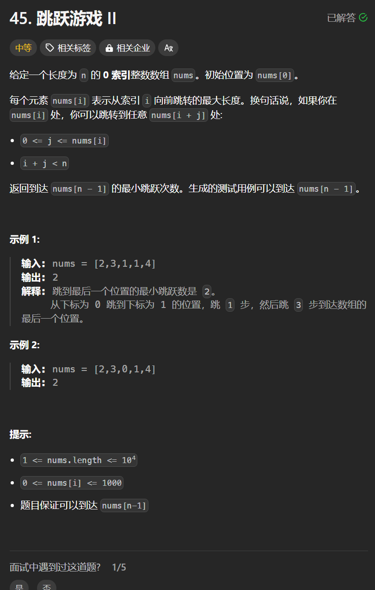

# 45. 跳跃游戏II
## 题目链接  
[45. 跳跃游戏II](https://leetcode.cn/problems/jump-game-ii/description/)
## 题目详情


***
## 解答一
答题者：**Yuiko630**

### 题解
>贪心算法，每次取最大的跳跃步数，看在当前覆盖范围内整体最优的最大跳跃范围能否更新到末尾，否则当跳到当前最大跳跃范围，就要走下一步，并更新为这个范围内的下一最大跳跃范围。

### 代码
``` Java
class Solution {
    public int jump(int[] nums) {
        if(nums.length == 1) return 0;
        int result = 0;
        int curDistance = 0;
        int nextDistance = 0;
        for(int i = 0; i <= curDistance; i ++){
            nextDistance = Math.max(nextDistance, nums[i] + i);
            if(i == curDistance){
                result ++;
                curDistance = nextDistance;
                if(curDistance >= nums.length - 1) return result;
            }
        }
        return result;
    }
}
```