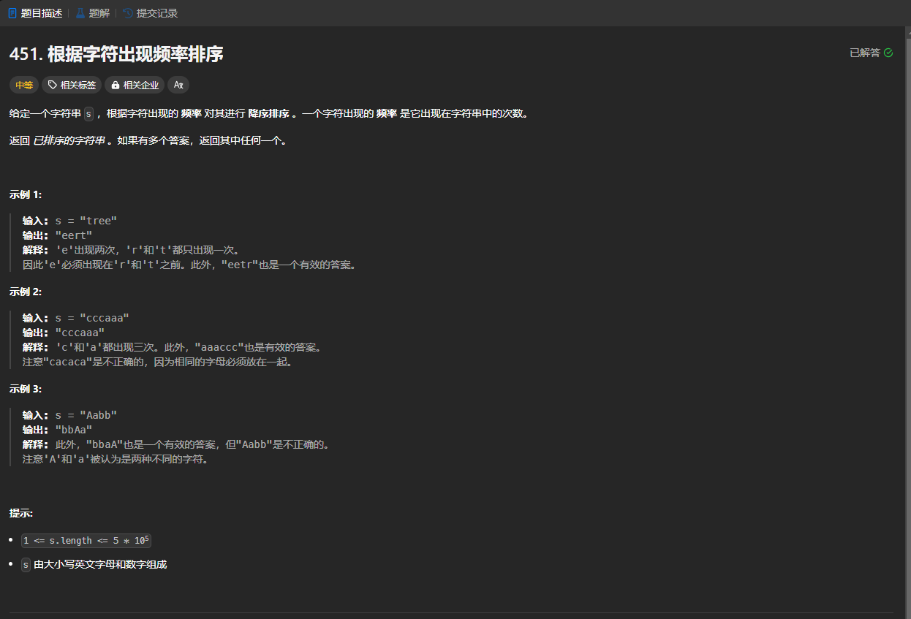

# 451. 根据字符出现频率排序
## 题目链接  
[451. 根据字符出现频率排序](https://leetcode.cn/problems/sort-characters-by-frequency/)
## 题目详情


***
## 解答一
答题者：EchoBai

### 题解
用一个`map`来统计各字符出现的次数，然后将其放入一个`vector`中按出现次数进行排序，最后根据每个字符出现的次数将其输出即可。

### 代码
``` cpp
class Solution {
public:
    string frequencySort(string s) {
        map<char,int> mp;
        for(auto e : s){
            ++mp[e];
        }
        vector<pair<char,int>> res;
        for(auto e : mp){
            res.push_back(make_pair(e.first, e.second));
        }
        sort(res.begin(),res.end(),cmp);
        string ans = "";
        for(auto r : res){
            for(int i = 0; i < r.second; ++i){
                ans.push_back(r.first);
            }
        }
        return ans;
    }
    static bool cmp(const pair<char,int> &p1, const pair<char,int> &p2){
        return p1.second > p2.second;
    }
};
```


