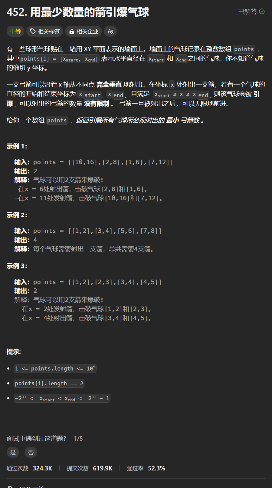

# 452. 用最少数量的箭引爆气球
## 题目链接  
[452. 用最少数量的箭引爆气球](https://leetcode.cn/problems/minimum-number-of-arrows-to-burst-balloons/description/)
## 题目详情


***
## 解答一
答题者：**Yuiko630**

### 题解
>为了让气球尽可能重叠，先对数组进行排序，若气球重叠，重叠中右边边界最小值之前的区间一定需要一个弓箭。注意xstart≤x≤xend即可引爆，则两个气球挨在一起不重叠也可以一起射爆。

### 代码
``` Java
class Solution {
    public int findMinArrowShots(int[][] points) {
        int result = 1;
        // 使用Integer内置比较方法，不会溢出
        Arrays.sort(points, (a,b) -> Integer.compare(a[0], b[0]));
        
        for(int i = 1; i < points.length; i++){
            if(points[i][0] > points[i-1][1]){
                result++;
            }
            else{
                points[i][1] = Math.min(points[i][1], points[i-1][1]);
            }
        }
        return result;
    }
}
```