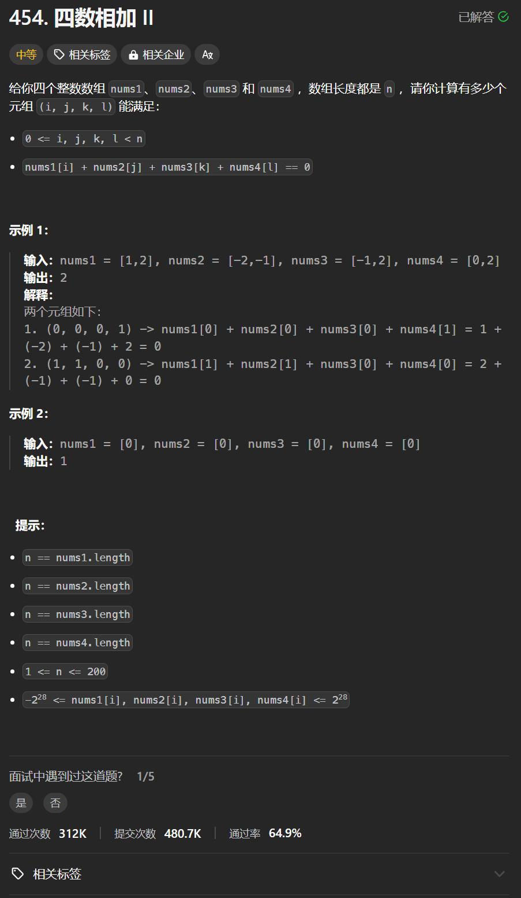

# 454. 四数相加II
## 题目链接  
[454. 四数相加II](https://leetcode.cn/problems/4sum-ii/description/)
## 题目详情


***
## 解答一
答题者：**Yuiko630**

### 题解
>1个map存放<A+B，出现次数>，1个map存放<C+D，出现次数>，最后看A+B+C+D=0一共出现过几次。

### 代码
``` Java
class Solution {
    public int fourSumCount(int[] nums1, int[] nums2, int[] nums3, int[] nums4) {
        int n = nums1.length;
        Map<Integer, Integer> sum1 = new HashMap<>();
        for(int i = 0; i < n; i++){
            for(int j = 0; j < n; j++){
                int sum = nums1[i] + nums2[j];
                sum1.put(sum, sum1.getOrDefault(sum, 0)+1);
            }
        }
        Map<Integer, Integer> sum2 = new HashMap<>();
        for(int i = 0; i < n; i++){
            for(int j = 0; j < n; j++){
                int sum = nums3[i] + nums4[j];
                sum2.put(sum, sum2.getOrDefault(sum, 0)+1);
            }
        }
        int result = 0;
        for(Integer num:sum1.keySet()){
            if(sum2.containsKey(0-num)){
                result+=sum1.get(num) * sum2.get(0-num);
            }
        }
        return result;
    }
}
```

***
## 解答二
答题者：**EchoBai**

### 题解
>使用map存放<e1 + e2，出现次数>，然后看 -(e3 + e4)是否在map中出现，出现则将次数累加上即可。

### 代码
```c++
class Solution {
public:
    int fourSumCount(vector<int>& nums1, vector<int>& nums2, vector<int>& nums3, vector<int>& nums4) {
        std::map<int, int> mp;
        int res = 0;
        for(auto e1: nums1){
            for(auto e2: nums2){
                mp[e1 + e2]++;
            }
        }
        for(auto e3: nums3){
            for(auto e4: nums4){
                // e1 + e2 = -(e3 + e4)
                if(mp.find(-(e3 + e4)) != mp.end()){
                    res += mp[-(e3 + e4)];
                }
            }
        }
        return res;
    }
};
```


