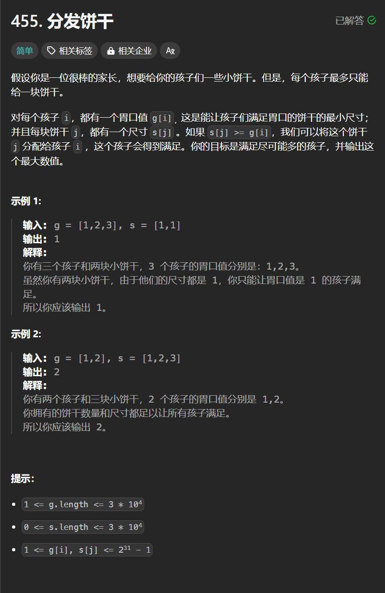

# 455. 分发饼干
## 题目链接  
[455. 分发饼干](https://leetcode.cn/problems/assign-cookies/description/)
## 题目详情


***
## 解答一
答题者：EchoBai

### 题解
先排序，让胃口小和小饼干在前面，如果当前饼干满足了胃口那直接饼干和孩子数组都往后移匹配下一个孩子和满足它胃口的最小饼干。如果不满足，那说明饼干小了，需要移动到更大饼干的位置满足。

### 代码
``` cpp
class Solution {
public:
    int findContentChildren(vector<int>& g, vector<int>& s) {
        int gsize = g.size();
        int ssize = s.size();
        sort(g.begin(), g.end());
        sort(s.begin(),s.end());
        int i = 0;
        int j = 0;
        int cnt = 0;
        while(i < gsize && j < ssize){
            if(s[j] >= g[i]){
                ++cnt;
                ++i;
                ++j;
            }else{
                ++j;
            }
        }
        return cnt;
    }
};
```
