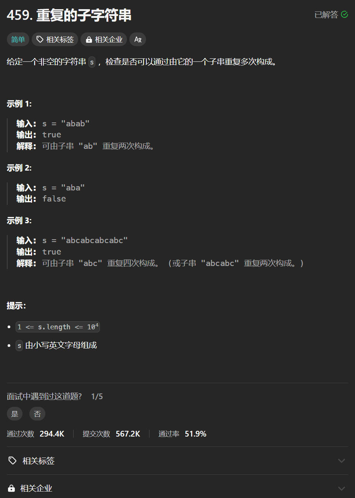

# 459. 重复的子字符串
## 题目链接  
[459. 重复的子字符串](https://leetcode.cn/problems/repeated-substring-pattern/description/)
## 题目详情


***
## 解答一
答题者：**Yuiko630**

### 题解
>双指针，子字符串的起始位置一定是下标0，末尾是i，遍历是否能与后面的[k, k-i+j+1)重复直到结束。

### 代码
``` Java
class Solution {
    public boolean repeatedSubstringPattern(String s) {
        int j = 0;
        for(int i = 0; i < s.length()/2; i++){
            String word = s.substring(j, i+1);
            for(int k = i+1; k < s.length()-i+j; k+=i-j+1){
                if(!s.substring(k, k + i -j+1).equals(word)) break;
                if(k+i-j+1 == s.length()) return true;
            }
        }
        return false;
    }
}
```

## 解答二
答题者：**Yuiko630**

### 题解
>将两个s拼接在一起，掐头去尾判断如果还能出现一个s，则说明是由重复子字符串构成。

### 代码
``` Java
class Solution {
    public boolean repeatedSubstringPattern(String s) {
        String newstring = new String(s+s);
        String str = newstring.substring(1, newstring.length()-1);
        if(str.contains(s)) return true;
        return false;
    }
}
```

## 解答三
答题者：**Yuiko630**

### 题解
>KMP算法有个规律，如果next的最后一个值>0，且s.length() % (s.length() - next的最后一个值) == 0，则说明s是由重复字符串构成。

### 代码
``` Java
class Solution {
    public boolean repeatedSubstringPattern(String s) {
        int[] next = new int[s.length()];
        int j = 0;
        next[0] = 0;
        for(int i = 1; i < s.length(); i++){
            while(j > 0 && s.charAt(j) != s.charAt(i)){
                j = next[j-1];
            }
            if(s.charAt(j) == s.charAt(i)){
                j++;
            }
            next[i] = j;
        }
        if(next[s.length()-1] > 0 && s.length() % (s.length() - next[s.length()-1]) == 0) return true;
        return false;
    }
}
```