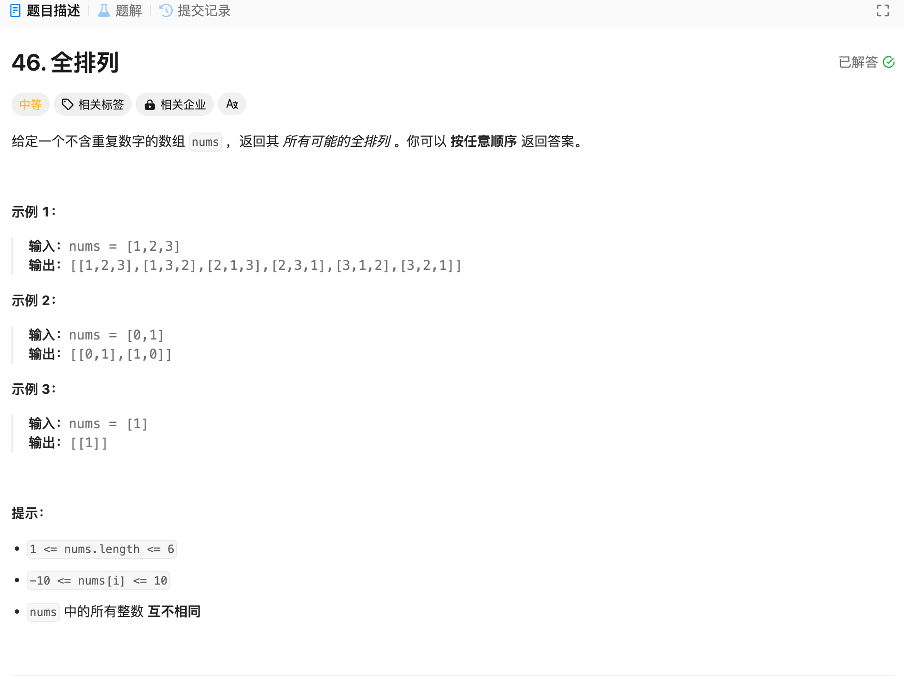

# 46. 全排列
## 题目链接  
[46. 全排列](https://leetcode.cn/problems/permutations/description/)
## 题目详情


***
## 解答一
答题者：EchoBai

### 题解
全排列问题，回溯法。终止条件就是排列子集长度等于nums的长度。同时，上一个已经选过的元素下次不能重复选择，因此用一个used数组标记用过的元素，记得传引用即可。

### 代码
``` cpp
class Solution {
    vector<vector<int>> res;
    vector<int> sets;
public:
    vector<vector<int>> permute(vector<int>& nums) {
        vector<bool> used(nums.size(), false);
        backtracking(nums, used);
        return res;
    }

    void backtracking(vector<int>& nums, vector<bool>& used){
        if(sets.size() == nums.size()){
            res.push_back(sets);
            return;
        }
        for(int i = 0; i < nums.size(); ++i){
            if(used[i] == false){
                sets.push_back(nums[i]);
                used[i] = true;
            }else{
                continue;
            }
            backtracking(nums, used);
            sets.pop_back();
            used[i] = false;
        }
    }
};
```
