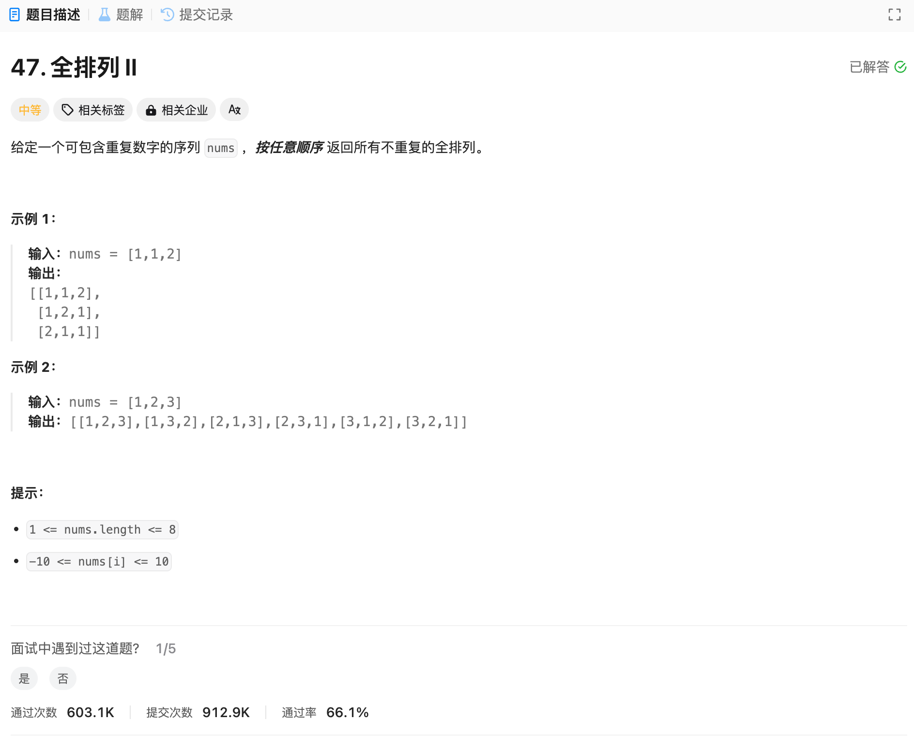

# 47. 全排列 II
## 题目链接  
[47. 全排列 II](https://leetcode.cn/problems/permutations-ii/description/)
## 题目详情


***
## 解答一
答题者：EchoBai

### 题解
全排列问题，回溯法。终止条件就是排列子集长度等于nums的长度。同时，上一个已经选过的元素下次不能重复选择，因此用一个used数组标记用过的元素，此题在46题的基础上增加了重复元素，因此只需要先对原数组进行排序同时引入一个set来对46的结果去重即可。当然也可以直接用if判断跳过重复的元素。

### 代码
``` cpp
class Solution {
    vector<vector<int>> res;
    set<vector<int>> uniqueRes;
    vector<int> permuteSets;
public:
    vector<vector<int>> permuteUnique(vector<int>& nums) {
        vector<bool> used(nums.size(), false);
        sort(nums.begin(), nums.end());
        backtraceing(nums, used);
        for(const auto& e : uniqueRes){
            res.push_back(e);
        }
        return res;
    }

    void backtraceing(vector<int>& nums, vector<bool>& used){
        if(permuteSets.size() == nums.size()){
            uniqueRes.insert(permuteSets);
            return;
        }
        for(int i = 0; i < nums.size(); ++i){
            if(used[i] == false){
                used[i] = true;
                permuteSets.push_back(nums[i]);
            }else{
                continue;
            }
            backtraceing(nums, used);
            permuteSets.pop_back();
            used[i] = false;
        }
    }
};
```
