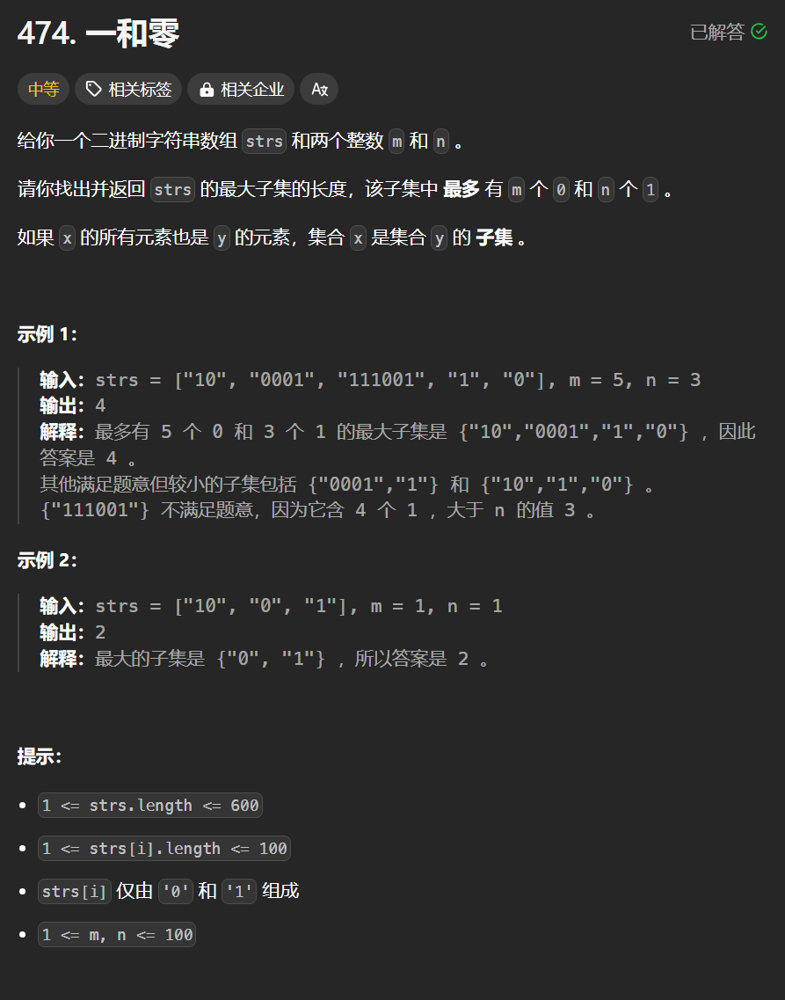

# 474. 一和零
## 题目链接  
[474. 一和零](https://leetcode.cn/problems/ones-and-zeroes/description/)
## 题目详情


***
## 解答一
答题者：**Yuiko630**

### 题解
>dp,dp[i][j]表示最多有i个0和j个1的strs的最大子集大小，转移时最外层遍历字符串，内层分别遍历0和1的数量，即容量。

### 代码
``` Java
class Solution {
    public int findMaxForm(String[] strs, int m, int n) {
        int[][] dp = new int[m+1][n+1];
        for(String str: strs){
            int oneNum = 0, zeroNum = 0;
            for(int k = 0; k < str.length(); k++){
                if(str.charAt(k) == '0') zeroNum++;
                else oneNum++;
            }
            for(int i = m; i >= zeroNum; i--){
                for(int j = n; j >= oneNum; j--){
                    dp[i][j] = Math.max(dp[i][j], dp[i-zeroNum][j-oneNum] + 1);
                }
            }
        }
        return dp[m][n];
    }
}
```