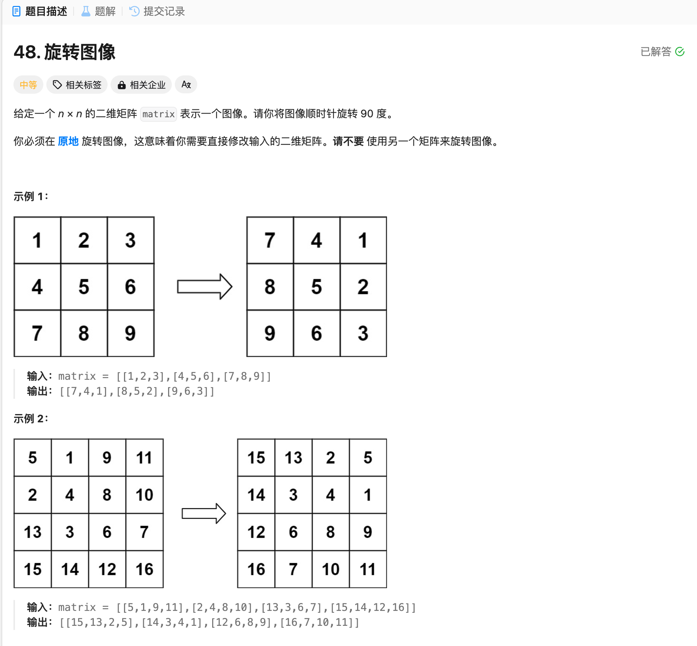

# 48. 旋转图像
## 题目链接  
[48. 旋转图像](https://leetcode.cn/problems/rotate-image/description/)
## 题目详情


***
## 解答一
答题者：EchoBai

### 题解
先水平翻转在沿对角线翻转。

### 代码
``` cpp
class Solution {
public:
    void rotate(vector<vector<int>>& matrix) {
        // (i,j) -> (n-i-1, j)
        int n = matrix.size();

        for(int i = 0; i < n / 2; ++i){
            for(int j = 0; j < n; ++j){
                swap(matrix[i][j], matrix[n - i - 1][j]);
            }
        }

        for(int i = 0; i < n ; ++i){
            for(int j = 0; j < i; ++j){
                swap(matrix[i][j], matrix[j][i]);
            }
        }
    }
};
```
