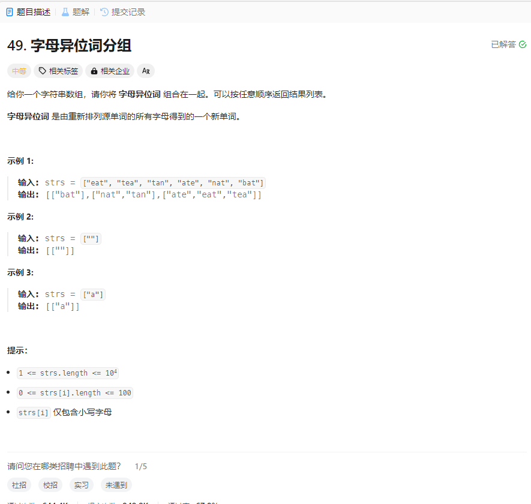

# 49. 字母异位词分组
## 题目链接  
[49. 字母异位词分组](https://leetcode.cn/problems/group-anagrams/description/?envType=study-plan-v2&envId=top-100-liked)
## 题目详情


***
## 解答一
答题者：EchoBai

### 题解
将每个字符串排序，然后将相同的下标都归到一起，最后在用原数组通过下标归组。

### 代码
``` cpp
class Solution {
public:
    vector<vector<string>> groupAnagrams(vector<string>& strs) {
        vector<vector<string>> res;
        vector<string> s = strs;
        map<string,vector<int>> mp;
        for(int i = 0; i < s.size(); ++i){
            sort(s[i].begin(),s[i].end());
            mp[s[i]].push_back(i);
        }
        for(auto e : mp){
            vector<string> vt;
            for(auto v : e.second){
                vt.push_back(strs[v]);
            }
            res.push_back(vt);
        }
        return res;
    }
};
```


