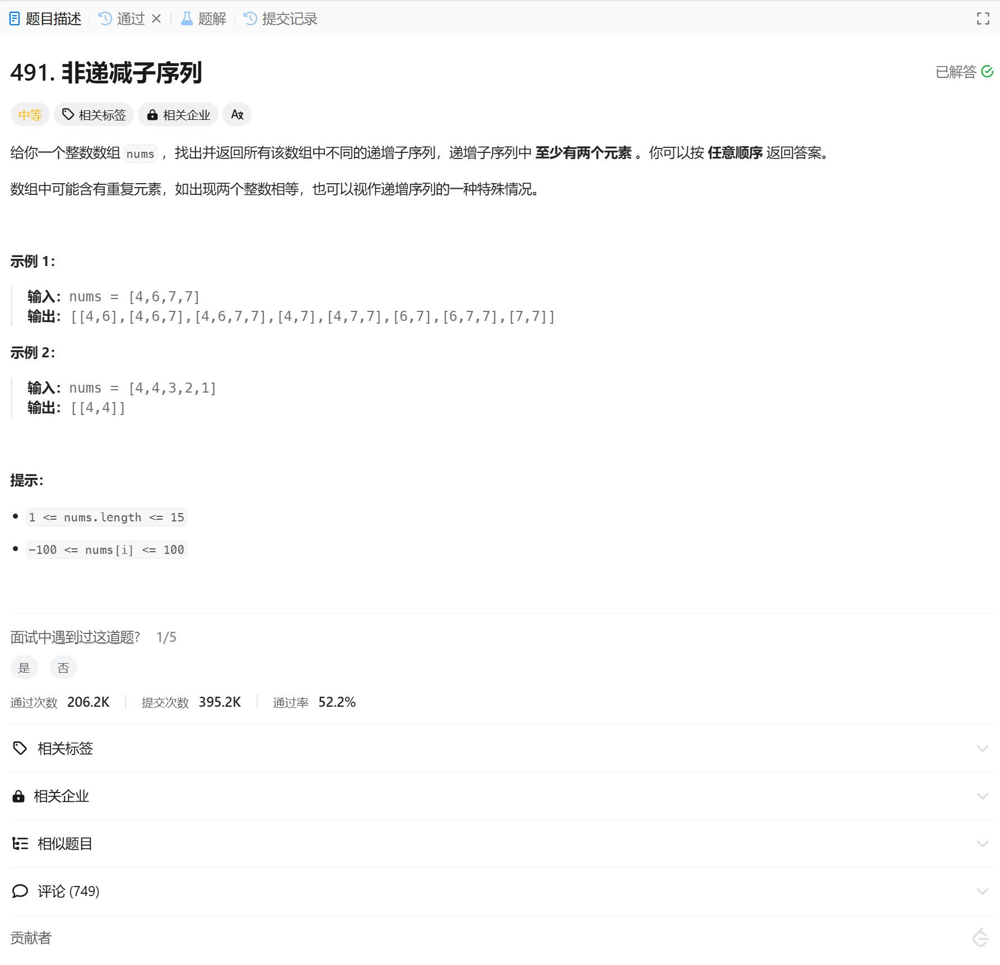

# 491. 非递减子序列
## 题目链接  
[491. 非递减子序列](https://leetcode.cn/problems/non-decreasing-subsequences/description/)
## 题目详情


***
## 解答一
答题者：EchoBai

### 题解
递归 + 回溯， 条件有2个，一是满足长度的情况，需要保存结果，因为在插入元素时已经保证了递增，所以此处只需判断长度即可，二是由于需要不断的找到最大的递增子序列，因此要让数的深度一直扩大到最大然后才能返回，最后去除重复解。

### 代码
``` cpp
class Solution {
    vector<vector<int>> res;
    set<vector<int>> uniqueRes;
    vector<int> comb;
public:
    vector<vector<int>> findSubsequences(vector<int>& nums) {
        backtracking(nums, 0);
        for(const auto& e : uniqueRes){
            res.emplace_back(e);
        }
        return res;
    }

    void backtracking(vector<int> &nums, int startIdx){
        if(comb.size() >= 2){
            uniqueRes.insert(comb);
        }
        if(startIdx == nums.size()){
            return;
        }

        for(int i = startIdx; i < nums.size(); ++i){
            if(startIdx == 0 || (nums[i] >= comb[comb.size()-1])){
                comb.push_back(nums[i]);
                backtracking(nums, i + 1);
                comb.pop_back();
            }
            
        }
    }
};
```
