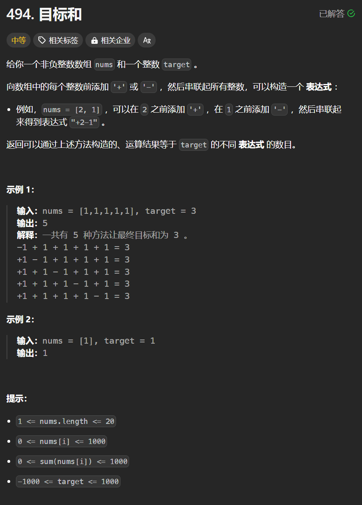

# 494. 目标和
## 题目链接  
[494. 目标和](https://leetcode.cn/problems/target-sum/description/)
## 题目详情


***
## 解答一
答题者：**Yuiko630**

### 题解
>求添加符号的方法数，题目可以转换成用nums装满容量为(target+sum)/2的背包有几种方法。dp，dp[i][j]表示用0-i的nums[i]装满容量为j的包有dp[i][j]种方法。初始化首行种dp[0][nums[0]]=1，其他均为0，首列中注意当物品数值为0时，应初始化为$2^t$种方法。

### 代码
``` Java
class Solution {
    public int findTargetSumWays(int[] nums, int target) {
        int sum = 0;
        for(int i = 0; i < nums.length; i++){
            sum += nums[i];
        }
        if(Math.abs(target) > sum || (target + sum) % 2 == 1) return 0;

        int bagSize = (target + sum) / 2;
        int[][] dp = new int[nums.length][bagSize + 1];

        // 初始化
        if(nums[0] <= bagSize) dp[0][nums[0]] = 1;
        int numZero = 0;
        for(int i = 0; i < nums.length; i++){
            if(nums[i] == 0) numZero++;
            dp[i][0] = (int)Math.pow(2, numZero);
        }
        // 状态转移
        for(int i = 1; i < nums.length; i++){
            for(int j = 0; j <= bagSize; j++){
                if(j < nums[i]) dp[i][j] = dp[i-1][j];
                else dp[i][j] = dp[i-1][j] + dp[i-1][j-nums[i]];
            }
        }
        return dp[nums.length-1][bagSize];
    }
}
```