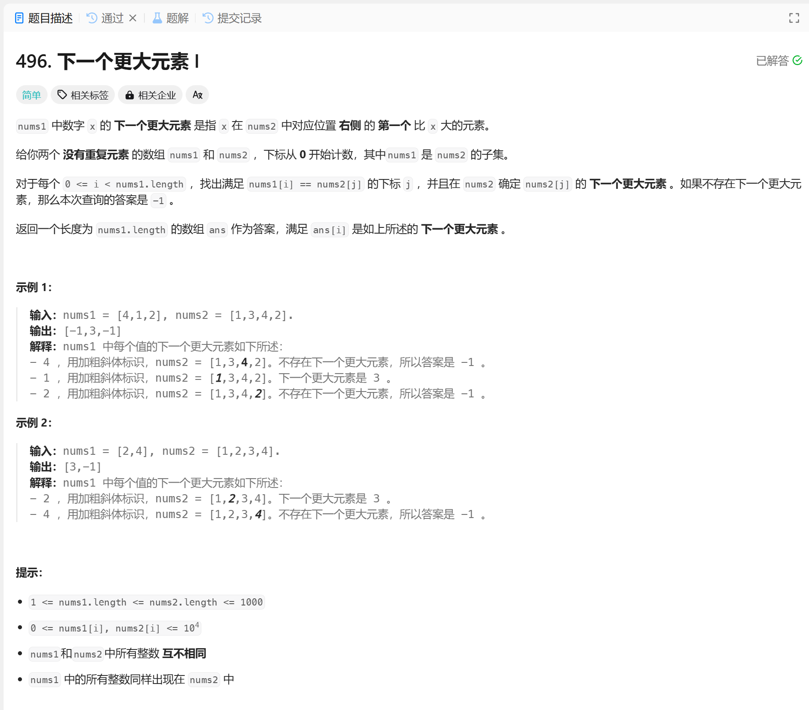

# 496. 下一个更大元素 I
## 题目链接  
[496. 下一个更大元素 I](https://leetcode.cn/problems/next-greater-element-i/description/)
## 题目详情


***
## 解答一
答题者：EchoBai

### 题解
用单调栈来实现，如果当前元素大于栈内元素，那就入栈，否则出栈，直到栈为空。也可以直接暴力遍历求解。

### 代码
``` cpp
class Solution {
public:
    vector<int> nextGreaterElement(vector<int>& nums1, vector<int>& nums2) {
        std::stack<int> st;
        std::map<int,int> mp;
        std::vector<int> res(nums1.size(), -1);

        for(int i = 0; i < nums2.size(); ++i){
            while(!st.empty() && nums2[i] > nums2[st.top()]){
                mp[nums2[st.top()]] = nums2[i];
                st.pop();
            }
            st.push(i);
        }

        for(int i = 0; i < nums1.size(); ++i){
            if(mp.find(nums1[i]) != mp.end()){
                res[i] = mp[nums1[i]];
            }
            
        }
        return res;
    }
};
```
