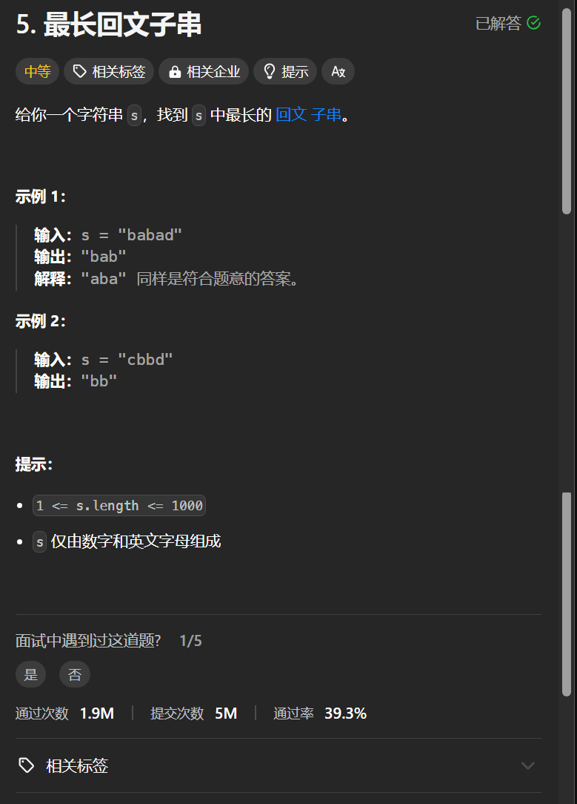

# 5. 最长回文子串
## 题目链接  
[5. 最长回文子串](https://leetcode.cn/problems/zigzag-conversion/description/)
## 题目详情


***
## 解答一
答题者：**Yuiko630**

## 题解
>一开始想的是两重循环遍历取子串看是不是回文串，结果用例超时。遂只能用动态规划来做判断dp[i][j]和dp[i+1][j-1]的关系。

### 代码
``` Java
class Solution {
    /*
    DP五部曲
    1. 定义：dp[i][j]=true表示i-j的子串是回文串
    2. 初始化：dp[i][i]单个字符一定是回文串=true，其他=false
    3. 转移方程：dp[i][j]= (j-i <= 1 || dp[i+1][j-1]) && s.charAt(i) == s.charAt(j)
    4. 遍历顺序：i从s.length()-1到0，j从i到s.length()-1 
    5. 注意字符串长度为1时单独判断
    */
    int result = 0;
    String str;
    public String longestPalindrome(String s) {
        int len = s.length();
        str = s.substring(0, result+1);
        if(len == 1) return s;
        boolean[][] dp = new boolean[len][len];
        for(int i = 0; i < len; i++){
            dp[i][i] = true;
        }
        for(int i = len-2; i >= 0; i--){
            for(int j = i+1; j < len; j++){
                dp[i][j] = (j-i <= 1 || dp[i+1][j-1]) && s.charAt(i) == s.charAt(j);
                if(dp[i][j] == true){
                    if(j - i + 1 > result){
                        result = j - i + 1;
                        str = s.substring(i, j + 1);
                    }
                }
            }
        }
        return str;
    }
}
```
