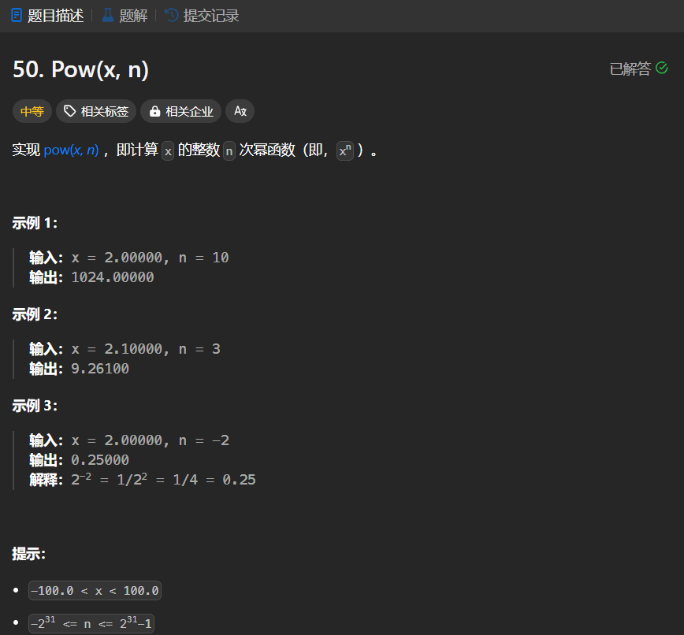

# 50. Pow(x, n)
## 题目链接  
[50. Pow(x, n)](https://leetcode.cn/problems/powx-n/description/)
## 题目详情


***
## 解答一
答题者：EchoBai

### 题解
首先不管`x,n`的正负，使用快速幂将值计算出来，然后如果`x`为负，那么我们判断一下`n`是否为奇数，如果是那么将结果取相反数即可。如果`n`为负，只需将结果取倒数即可。

### 代码
``` cpp
class Solution {
public:
    double myPow(double x, int n) {
        int flag1 = 0, flag2 = 0;
        int remain_n = abs(n);
        if(x < 0){
            flag1 = 1;
            x = abs(x);
        }
        if( n < 0){
            flag2 = 1;
            n = abs(n);
        }
        
        double ans = 1;
        double base = x;
        while(n > 0){
            if(n & 1){
                ans *= base;
            }
            base *= base;
            n >>= 1;

        }
        
        if(flag1 == 1 && remain_n % 2 == 1)
            ans = -ans;
        if(flag2 == 1)
            ans = 1/ans;
        return ans;
    }
};
```


