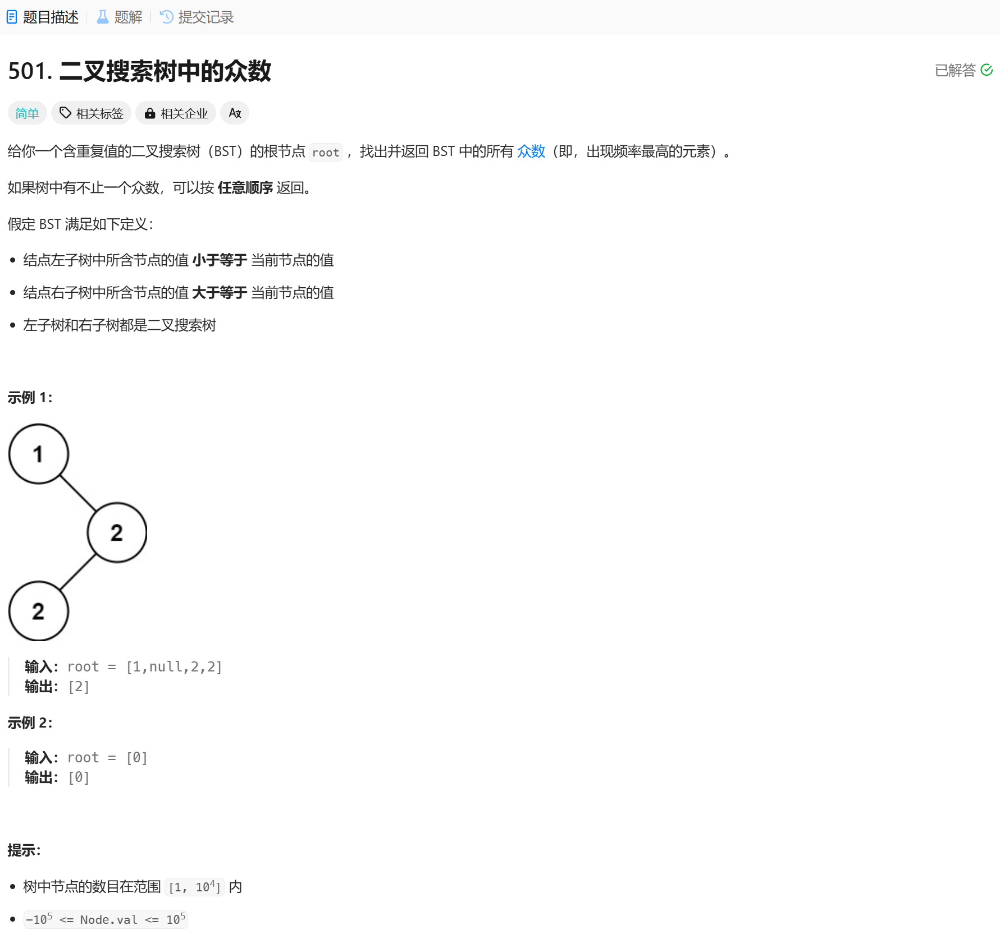

# 501. 二叉搜索树中的众数
## 题目链接  
[501. 二叉搜索树中的众数](https://leetcode.cn/problems/find-mode-in-binary-search-tree/description/)
## 题目详情


## 解答一
答题者：EchoBai

### 题解
递归遍历，记录次数最后的，用mp统计每个元素的次数，将次数最多的加入vector中即可。

### 代码
``` cpp
/**
 * Definition for a binary tree node.
 * struct TreeNode {
 *     int val;
 *     TreeNode *left;
 *     TreeNode *right;
 *     TreeNode() : val(0), left(nullptr), right(nullptr) {}
 *     TreeNode(int x) : val(x), left(nullptr), right(nullptr) {}
 *     TreeNode(int x, TreeNode *left, TreeNode *right) : val(x), left(left), right(right) {}
 * };
 */
class Solution {
public:
    vector<int> findMode(TreeNode* root) {
        std::map<int,int> mp;
        int cntVal = 0;
        travel(root,mp, cntVal);
        
        vector<int> res;
        for(const auto& e : mp){
            if(e.second == cntVal){
                res.push_back(e.first);
            }
        }
        return res;
    }

    void travel(TreeNode* root, std::map<int,int>& mp, int &cntVal){
        if(!root) return;
        mp[root->val]++;
        if(mp[root->val] > cntVal){
            cntVal = mp[root->val];
        }
        travel(root->left,mp,cntVal);
        travel(root->right,mp,cntVal);
    }
};
```

## 解答二
答题者：**Yuiko630**

### 题解
>一次迭代遍历，利用pre和cur比较是否重复，记录count出现次数，如果超过当前最大的maxCount则更新result数组和maxCount。

### 代码
``` Java
/**
 * Definition for a binary tree node.
 * public class TreeNode {
 *     int val;
 *     TreeNode left;
 *     TreeNode right;
 *     TreeNode() {}
 *     TreeNode(int val) { this.val = val; }
 *     TreeNode(int val, TreeNode left, TreeNode right) {
 *         this.val = val;
 *         this.left = left;
 *         this.right = right;
 *     }
 * }
 */
class Solution {
    public int[] findMode(TreeNode root) {
        if(root != null && root.left == null && root.right == null) return new int[]{root.val};
        ArrayList<Integer> result = new ArrayList<>();
        Stack<TreeNode> stack = new Stack<>();
        int maxCount = 0;
        int count = 0;
        TreeNode cur = root;
        TreeNode pre = null;
        while(!stack.isEmpty() || cur != null){
            if(cur != null){
                stack.push(cur);
                cur = cur.left;
            }
            else{
                cur = stack.pop();
                if(pre == null || pre.val != cur.val){
                    count = 1;
                }
                else{
                    count ++;
                }
                if(count > maxCount){
                    result.clear();
                    result.add(cur.val);
                    maxCount = count;
                }
                else if(count == maxCount){
                    result.add(cur.val);
                }
                pre = cur;
                cur = cur.right;
            }
        }
        return result.stream().mapToInt(Integer::intValue).toArray();
    }
}
```
